# Imports


```python
from statsmodels.stats.outliers_influence import variance_inflation_factor
from sklearn.model_selection import train_test_split
from pycm import ConfusionMatrix
from pandas.plotting import scatter_matrix, andrews_curves, parallel_coordinates
from sklearn.metrics import median_absolute_error
from sklearn.neighbors import KNeighborsClassifier
from sklearn.svm import SVC
from sklearn.naive_bayes import GaussianNB
from sklearn.naive_bayes import CategoricalNB
from sklearn.naive_bayes import BernoulliNB
from sklearn.naive_bayes import MultinomialNB
from sklearn.metrics import accuracy_score
from sklearn.metrics import precision_score
from sklearn.metrics import recall_score
from sklearn.metrics import f1_score
from sklearn.metrics import mean_squared_error
from sklearn.metrics import mean_absolute_error
from sklearn.metrics import roc_curve
from sklearn.metrics import roc_auc_score, auc
from sklearn.metrics import confusion_matrix
from sklearn.metrics import classification_report
from sklearn.preprocessing import StandardScaler
import seaborn as sns
import matplotlib.pyplot as plt
import matplotlib as mpl
import sklearn
import numpy as np
import os
import pandas as pd
import random
from IPython.display import Markdown, display
%matplotlib inline


def printmd(string):
    display(Markdown(string))
```

# Importing the csv files

Importing the dataset and storing it in a variable called data


```python
data = pd.read_csv('./data/data.csv')
```

# Data Exploration

# This dataset as 21 features and 2000 entries. The meanings of the features are given below:

- battery_power: Total energy a battery can store in one time measured in mAh
- blue: Has bluetooth or not
- clock_speed: speed at which microprocessor executes instructions
- dual_sim: Has dual sim support or not
- fc: Front Camera mega pixels
- four_g: Has 4G or not
- int_memory: Internal Memory in Gigabytes
- m_dep: Mobile Depth in cm
- mobile_wt: Weight of mobile phone
- n_cores: Number of cores of processor
- pc: Primary Camera mega pixels
- px_height: Pixel Resolution Height
- px_width: Pixel Resolution Width
- ram: Random Access Memory in Mega Byte
- sc_h: Screen Height of mobile in cm
- sc_w: Screen Width of mobile in cm
- talk_time: longest time that a single battery charge will last when you are
- three_g: Has 3G or not
- touch_screen: Has touch screen or not
- wifi: Has wifi or not
- price_range: This is the target variable with value of 0(low cost), 1(medium cost), 2(high cost) and 3(very high cost).


```python
print(data.columns)
```

    Index(['battery_power', 'blue', 'clock_speed', 'dual_sim', 'fc', 'four_g',
           'int_memory', 'm_dep', 'mobile_wt', 'n_cores', 'pc', 'px_height',
           'px_width', 'ram', 'sc_h', 'sc_w', 'talk_time', 'three_g',
           'touch_screen', 'wifi', 'price_range'],
          dtype='object')


```python
data.head()
```


<div>
<style scoped>
    .dataframe tbody tr th:only-of-type {
        vertical-align: middle;
    }

    .dataframe tbody tr th {
        vertical-align: top;
    }

    .dataframe thead th {
        text-align: right;
    }
</style>
<table border="1" class="dataframe">
  <thead>
    <tr style="text-align: right;">
      <th></th>
      <th>battery_power</th>
      <th>blue</th>
      <th>clock_speed</th>
      <th>dual_sim</th>
      <th>fc</th>
      <th>four_g</th>
      <th>int_memory</th>
      <th>m_dep</th>
      <th>mobile_wt</th>
      <th>n_cores</th>
      <th>...</th>
      <th>px_height</th>
      <th>px_width</th>
      <th>ram</th>
      <th>sc_h</th>
      <th>sc_w</th>
      <th>talk_time</th>
      <th>three_g</th>
      <th>touch_screen</th>
      <th>wifi</th>
      <th>price_range</th>
    </tr>
  </thead>
  <tbody>
    <tr>
      <th>0</th>
      <td>842</td>
      <td>0</td>
      <td>2.2</td>
      <td>0</td>
      <td>1</td>
      <td>0</td>
      <td>7</td>
      <td>0.6</td>
      <td>188</td>
      <td>2</td>
      <td>...</td>
      <td>20</td>
      <td>756</td>
      <td>2549</td>
      <td>9</td>
      <td>7</td>
      <td>19</td>
      <td>0</td>
      <td>0</td>
      <td>1</td>
      <td>1</td>
    </tr>
    <tr>
      <th>1</th>
      <td>1021</td>
      <td>1</td>
      <td>0.5</td>
      <td>1</td>
      <td>0</td>
      <td>1</td>
      <td>53</td>
      <td>0.7</td>
      <td>136</td>
      <td>3</td>
      <td>...</td>
      <td>905</td>
      <td>1988</td>
      <td>2631</td>
      <td>17</td>
      <td>3</td>
      <td>7</td>
      <td>1</td>
      <td>1</td>
      <td>0</td>
      <td>2</td>
    </tr>
    <tr>
      <th>2</th>
      <td>563</td>
      <td>1</td>
      <td>0.5</td>
      <td>1</td>
      <td>2</td>
      <td>1</td>
      <td>41</td>
      <td>0.9</td>
      <td>145</td>
      <td>5</td>
      <td>...</td>
      <td>1263</td>
      <td>1716</td>
      <td>2603</td>
      <td>11</td>
      <td>2</td>
      <td>9</td>
      <td>1</td>
      <td>1</td>
      <td>0</td>
      <td>2</td>
    </tr>
    <tr>
      <th>3</th>
      <td>615</td>
      <td>1</td>
      <td>2.5</td>
      <td>0</td>
      <td>0</td>
      <td>0</td>
      <td>10</td>
      <td>0.8</td>
      <td>131</td>
      <td>6</td>
      <td>...</td>
      <td>1216</td>
      <td>1786</td>
      <td>2769</td>
      <td>16</td>
      <td>8</td>
      <td>11</td>
      <td>1</td>
      <td>0</td>
      <td>0</td>
      <td>2</td>
    </tr>
    <tr>
      <th>4</th>
      <td>1821</td>
      <td>1</td>
      <td>1.2</td>
      <td>0</td>
      <td>13</td>
      <td>1</td>
      <td>44</td>
      <td>0.6</td>
      <td>141</td>
      <td>2</td>
      <td>...</td>
      <td>1208</td>
      <td>1212</td>
      <td>1411</td>
      <td>8</td>
      <td>2</td>
      <td>15</td>
      <td>1</td>
      <td>1</td>
      <td>0</td>
      <td>1</td>
    </tr>
  </tbody>
</table>
<p>5 rows × 21 columns</p>
</div>


```python
data.shape
```


    (2000, 21)


```python
data.info(verbose=True)
```

    <class 'pandas.core.frame.DataFrame'>
    RangeIndex: 2000 entries, 0 to 1999
    Data columns (total 21 columns):
     #   Column         Non-Null Count  Dtype  
    ---  ------         --------------  -----  
     0   battery_power  2000 non-null   int64  
     1   blue           2000 non-null   int64  
     2   clock_speed    2000 non-null   float64
     3   dual_sim       2000 non-null   int64  
     4   fc             2000 non-null   int64  
     5   four_g         2000 non-null   int64  
     6   int_memory     2000 non-null   int64  
     7   m_dep          2000 non-null   float64
     8   mobile_wt      2000 non-null   int64  
     9   n_cores        2000 non-null   int64  
     10  pc             2000 non-null   int64  
     11  px_height      2000 non-null   int64  
     12  px_width       2000 non-null   int64  
     13  ram            2000 non-null   int64  
     14  sc_h           2000 non-null   int64  
     15  sc_w           2000 non-null   int64  
     16  talk_time      2000 non-null   int64  
     17  three_g        2000 non-null   int64  
     18  touch_screen   2000 non-null   int64  
     19  wifi           2000 non-null   int64  
     20  price_range    2000 non-null   int64  
    dtypes: float64(2), int64(19)
    memory usage: 328.2 KB


The above info reveals that all attributes are numerical i.e. either float or int


```python
data.describe() 
```


<div>
<style scoped>
    .dataframe tbody tr th:only-of-type {
        vertical-align: middle;
    }

    .dataframe tbody tr th {
        vertical-align: top;
    }

    .dataframe thead th {
        text-align: right;
    }
</style>
<table border="1" class="dataframe">
  <thead>
    <tr style="text-align: right;">
      <th></th>
      <th>battery_power</th>
      <th>blue</th>
      <th>clock_speed</th>
      <th>dual_sim</th>
      <th>fc</th>
      <th>four_g</th>
      <th>int_memory</th>
      <th>m_dep</th>
      <th>mobile_wt</th>
      <th>n_cores</th>
      <th>...</th>
      <th>px_height</th>
      <th>px_width</th>
      <th>ram</th>
      <th>sc_h</th>
      <th>sc_w</th>
      <th>talk_time</th>
      <th>three_g</th>
      <th>touch_screen</th>
      <th>wifi</th>
      <th>price_range</th>
    </tr>
  </thead>
  <tbody>
    <tr>
      <th>count</th>
      <td>2000.000000</td>
      <td>2000.0000</td>
      <td>2000.000000</td>
      <td>2000.000000</td>
      <td>2000.000000</td>
      <td>2000.000000</td>
      <td>2000.000000</td>
      <td>2000.000000</td>
      <td>2000.000000</td>
      <td>2000.000000</td>
      <td>...</td>
      <td>2000.000000</td>
      <td>2000.000000</td>
      <td>2000.000000</td>
      <td>2000.000000</td>
      <td>2000.000000</td>
      <td>2000.000000</td>
      <td>2000.000000</td>
      <td>2000.000000</td>
      <td>2000.000000</td>
      <td>2000.000000</td>
    </tr>
    <tr>
      <th>mean</th>
      <td>1238.518500</td>
      <td>0.4950</td>
      <td>1.522250</td>
      <td>0.509500</td>
      <td>4.309500</td>
      <td>0.521500</td>
      <td>32.046500</td>
      <td>0.501750</td>
      <td>140.249000</td>
      <td>4.520500</td>
      <td>...</td>
      <td>645.108000</td>
      <td>1251.515500</td>
      <td>2124.213000</td>
      <td>12.306500</td>
      <td>5.767000</td>
      <td>11.011000</td>
      <td>0.761500</td>
      <td>0.503000</td>
      <td>0.507000</td>
      <td>1.500000</td>
    </tr>
    <tr>
      <th>std</th>
      <td>439.418206</td>
      <td>0.5001</td>
      <td>0.816004</td>
      <td>0.500035</td>
      <td>4.341444</td>
      <td>0.499662</td>
      <td>18.145715</td>
      <td>0.288416</td>
      <td>35.399655</td>
      <td>2.287837</td>
      <td>...</td>
      <td>443.780811</td>
      <td>432.199447</td>
      <td>1084.732044</td>
      <td>4.213245</td>
      <td>4.356398</td>
      <td>5.463955</td>
      <td>0.426273</td>
      <td>0.500116</td>
      <td>0.500076</td>
      <td>1.118314</td>
    </tr>
    <tr>
      <th>min</th>
      <td>501.000000</td>
      <td>0.0000</td>
      <td>0.500000</td>
      <td>0.000000</td>
      <td>0.000000</td>
      <td>0.000000</td>
      <td>2.000000</td>
      <td>0.100000</td>
      <td>80.000000</td>
      <td>1.000000</td>
      <td>...</td>
      <td>0.000000</td>
      <td>500.000000</td>
      <td>256.000000</td>
      <td>5.000000</td>
      <td>0.000000</td>
      <td>2.000000</td>
      <td>0.000000</td>
      <td>0.000000</td>
      <td>0.000000</td>
      <td>0.000000</td>
    </tr>
    <tr>
      <th>25%</th>
      <td>851.750000</td>
      <td>0.0000</td>
      <td>0.700000</td>
      <td>0.000000</td>
      <td>1.000000</td>
      <td>0.000000</td>
      <td>16.000000</td>
      <td>0.200000</td>
      <td>109.000000</td>
      <td>3.000000</td>
      <td>...</td>
      <td>282.750000</td>
      <td>874.750000</td>
      <td>1207.500000</td>
      <td>9.000000</td>
      <td>2.000000</td>
      <td>6.000000</td>
      <td>1.000000</td>
      <td>0.000000</td>
      <td>0.000000</td>
      <td>0.750000</td>
    </tr>
    <tr>
      <th>50%</th>
      <td>1226.000000</td>
      <td>0.0000</td>
      <td>1.500000</td>
      <td>1.000000</td>
      <td>3.000000</td>
      <td>1.000000</td>
      <td>32.000000</td>
      <td>0.500000</td>
      <td>141.000000</td>
      <td>4.000000</td>
      <td>...</td>
      <td>564.000000</td>
      <td>1247.000000</td>
      <td>2146.500000</td>
      <td>12.000000</td>
      <td>5.000000</td>
      <td>11.000000</td>
      <td>1.000000</td>
      <td>1.000000</td>
      <td>1.000000</td>
      <td>1.500000</td>
    </tr>
    <tr>
      <th>75%</th>
      <td>1615.250000</td>
      <td>1.0000</td>
      <td>2.200000</td>
      <td>1.000000</td>
      <td>7.000000</td>
      <td>1.000000</td>
      <td>48.000000</td>
      <td>0.800000</td>
      <td>170.000000</td>
      <td>7.000000</td>
      <td>...</td>
      <td>947.250000</td>
      <td>1633.000000</td>
      <td>3064.500000</td>
      <td>16.000000</td>
      <td>9.000000</td>
      <td>16.000000</td>
      <td>1.000000</td>
      <td>1.000000</td>
      <td>1.000000</td>
      <td>2.250000</td>
    </tr>
    <tr>
      <th>max</th>
      <td>1998.000000</td>
      <td>1.0000</td>
      <td>3.000000</td>
      <td>1.000000</td>
      <td>19.000000</td>
      <td>1.000000</td>
      <td>64.000000</td>
      <td>1.000000</td>
      <td>200.000000</td>
      <td>8.000000</td>
      <td>...</td>
      <td>1960.000000</td>
      <td>1998.000000</td>
      <td>3998.000000</td>
      <td>19.000000</td>
      <td>18.000000</td>
      <td>20.000000</td>
      <td>1.000000</td>
      <td>1.000000</td>
      <td>1.000000</td>
      <td>3.000000</td>
    </tr>
  </tbody>
</table>
<p>8 rows × 21 columns</p>
</div>


The above show some basic metrics for each feature in our dataset

# Data Visualization

## Histogram Plot


```python
#To plot a histogram for each numerical attribute
data.hist(bins=50, figsize=(20,15))
plt.show()
```


    
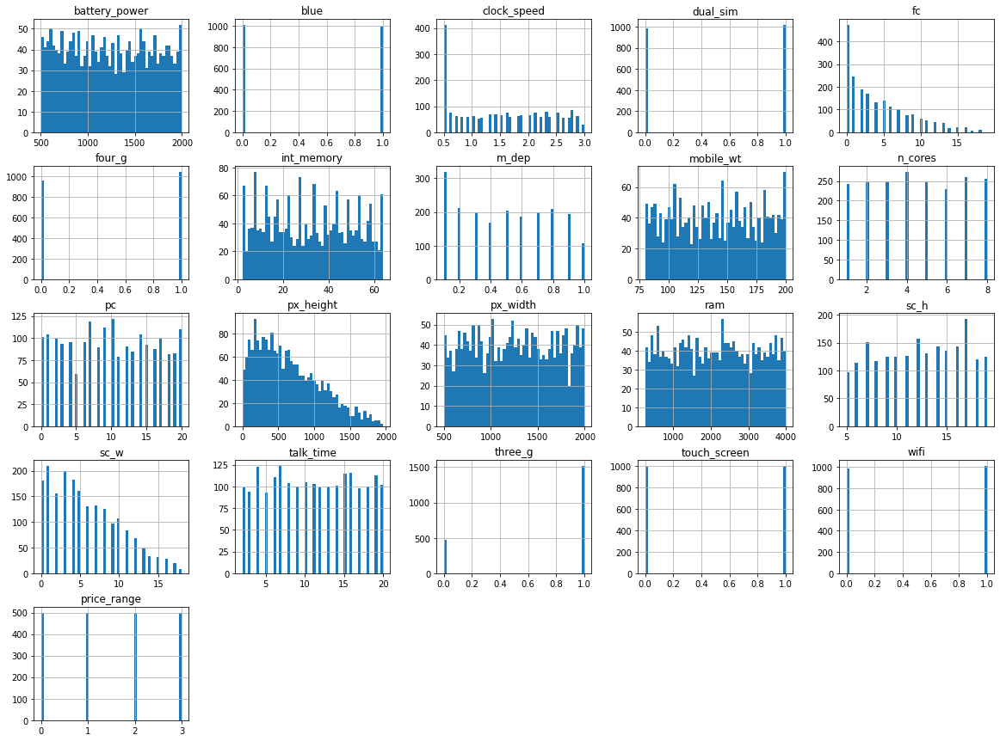
    


## Box Plots and Pie Charts

The following code will find all the features that are binary ,will print them and store their column names in a list

It plots a pie chart for each binary feature and a boxplot for the rest


```python
def plot_boxplot(data):  
    binary_features = [] # list of binary features
    for col in data.columns:
        if data[col].unique().shape[0] == 2: # if there are only two unique values i.e. binary features
            print(col)
            binary_features.append(col)  
    fig, ax = plt.subplots(len(data.columns)//3, 3, figsize=(20, len(data.columns)*2), frameon=False)
    c = 0
    for col in data.columns:

        if (col in binary_features):
            ax[c//3, c % 3].set_title(col)  
            ax[c//3, c % 3].pie(data[col].value_counts(), labels=data[col].unique())
            ax[c//3, c % 3].set_title(col)
            ax[c//3, c % 3].legend(loc='best')
        else:
            ax[c//3, c % 3].set_title(col)  
            sns.boxplot(x=data[col],data=data, ax=ax[c//3, c % 3])
        c += 1
    plt.show()

```


```python
plot_boxplot(data)
```

    blue
    dual_sim
    four_g
    three_g
    touch_screen
    wifi


    
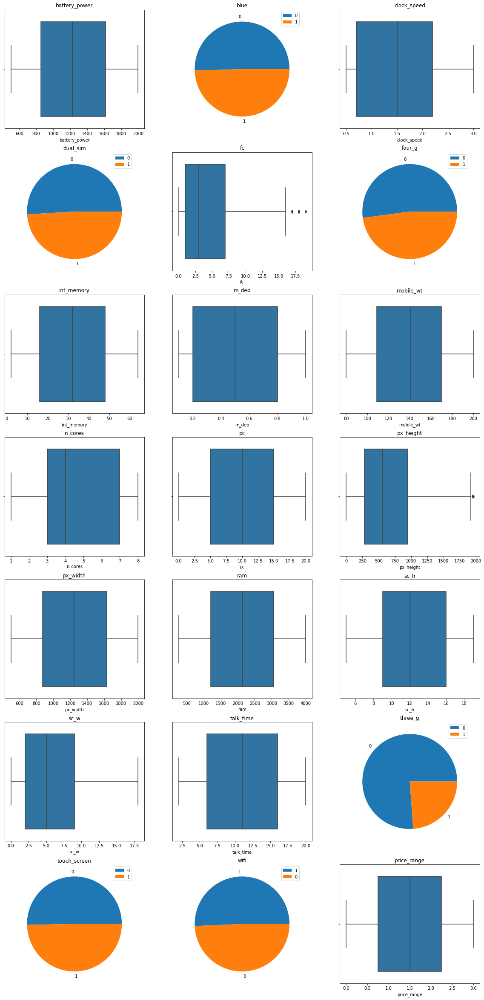
    


From the above boxplots, we can see that fc (front cameras) and px_height (pixel height) are the only features with outliers, we can try to remove the outliers using the formula below, i.e. setting a treshold value for the outliers and then removing them from the dataset.


```python
for feature in data.columns:
    mean = data[feature].mean()
    std = data[feature].std()
    treshold = std * 3
    
    lower_bound = mean - treshold
    upper_bound = mean + treshold
    
    data = data[(data[feature] > lower_bound) & (data[feature] < upper_bound)]
```


```python
plot_boxplot(data)
```

    blue
    dual_sim
    four_g
    three_g
    touch_screen
    wifi


    
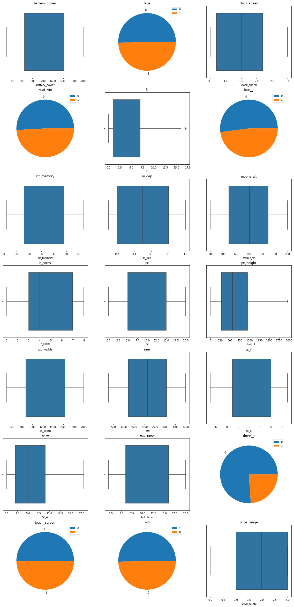
    


We can see that we have significantly reduced the outliers in the dataset.


```python
data.shape
```


    (1988, 21)


Also we can see that 12 entries were removed in the process of removing the outliers.

## Correlation Matrix and Heatmap

The following code finds the correlation matrix of our dataset and plots a heatmap of it


```python
corr_matrix = data.corr()
# increases the resolution of the plot
plt.figure(figsize=(20,15))
sns.heatmap(corr_matrix, square=True, cmap='Purples', annot=True, fmt='.2f')
plt.show()
```


    
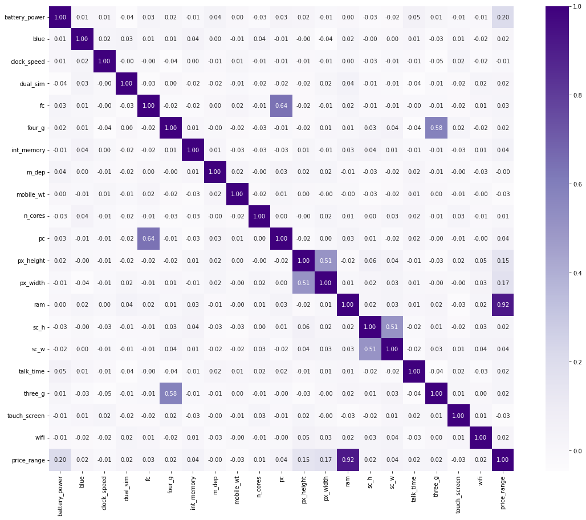
    


The above correlation matrix shows how our Price Range has a very strong correlation with RAM.

Also

* 3G and 4G
* pc(Primary Camera mega pixels) and fc(Front Camera mega pixels)
* px_weight(Pixel Resolution Width) and px_height(Pixel Resolution Height)
* sc_w(Screen Width of mobile in cm) and sc_h(Screen Height of mobile in cm)
features have highly positive correlation.


```python
corr_matrix['price_range'].sort_values(ascending=False)
```


    price_range      1.000000
    ram              0.916742
    battery_power    0.201768
    px_width         0.167571
    px_height        0.150439
    int_memory       0.044144
    sc_w             0.037836
    pc               0.036343
    fc               0.027334
    sc_h             0.024294
    three_g          0.023952
    talk_time        0.020810
    dual_sim         0.019325
    wifi             0.018434
    blue             0.018009
    four_g           0.015254
    n_cores          0.007159
    m_dep           -0.001570
    clock_speed     -0.006042
    mobile_wt       -0.031180
    touch_screen    -0.031501
    Name: price_range, dtype: float64


ram has the highest positive correlation with the price_range of a positive 0.917, which implies the price_range is directly proportional to the ram and as the ram increases the price_range increases

The abs function will get the absolute values i.e. only the magnitude for the correlation matrix which will help me better understand the magnitude for the correlation between various features


```python
corr_matrix_abs = data.corr().abs()
corr_matrix_abs['price_range'].sort_values(ascending=False)
```


    price_range      1.000000
    ram              0.916742
    battery_power    0.201768
    px_width         0.167571
    px_height        0.150439
    int_memory       0.044144
    sc_w             0.037836
    pc               0.036343
    touch_screen     0.031501
    mobile_wt        0.031180
    fc               0.027334
    sc_h             0.024294
    three_g          0.023952
    talk_time        0.020810
    dual_sim         0.019325
    wifi             0.018434
    blue             0.018009
    four_g           0.015254
    n_cores          0.007159
    clock_speed      0.006042
    m_dep            0.001570
    Name: price_range, dtype: float64


```python
sns.pairplot(data[corr_matrix_abs['price_range'].sort_values(
    ascending=False).index[:6]], hue='price_range', palette='hls')
plt.show()

```


    
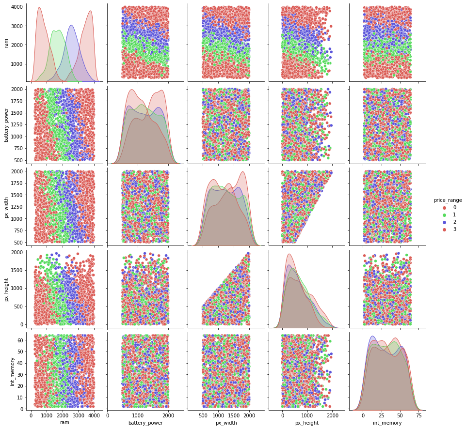
    


## Scatter Matrix to visualize the relation between various positively correlated features in our dataset (with respect to price range).


```python
highly_correlated_features = corr_matrix['price_range'].sort_values(ascending=False).index[:6]
scatter_matrix(data[highly_correlated_features], figsize=(20, 10))
plt.show()
data[highly_correlated_features].info()
```


    
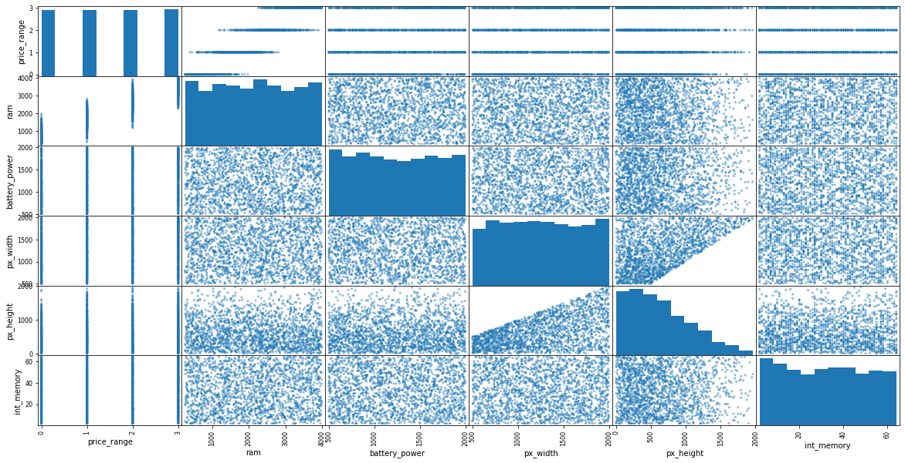
    


    <class 'pandas.core.frame.DataFrame'>
    Int64Index: 1988 entries, 0 to 1999
    Data columns (total 6 columns):
     #   Column         Non-Null Count  Dtype
    ---  ------         --------------  -----
     0   price_range    1988 non-null   int64
     1   ram            1988 non-null   int64
     2   battery_power  1988 non-null   int64
     3   px_width       1988 non-null   int64
     4   px_height      1988 non-null   int64
     5   int_memory     1988 non-null   int64
    dtypes: int64(6)
    memory usage: 173.3 KB


## Visualizing the distribution of the price range


```python
# visualizing the distribution of the price range
sns.countplot(x = "price_range", data = data, palette = "hls")
plt.show()
```


    
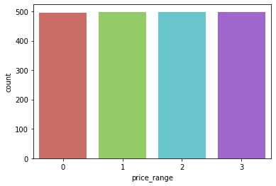
    


## Visualizing the relation between the count of phones in a range of ram values for every price range.


```python
sns.FacetGrid(data, col="price_range", hue="price_range", palette="hls", height=5).map(
    sns.histplot, "ram", kde=True, linewidth=0).add_legend()
plt.show()
```


    
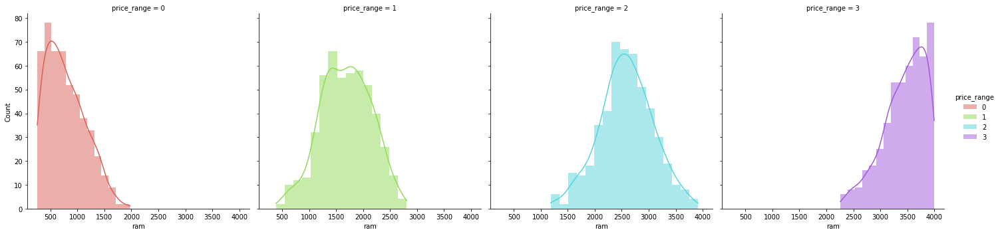
    


From the above histogram plots, we can see that the price range is almost equally distributed (by count) accross the classes we are attempting to classify and have a clear separation (very less overlap).


```python
sns.relplot(x='price_range',y='ram',data=data,kind='scatter', hue='price_range')
```


    <seaborn.axisgrid.FacetGrid at 0x146a88d00>


    
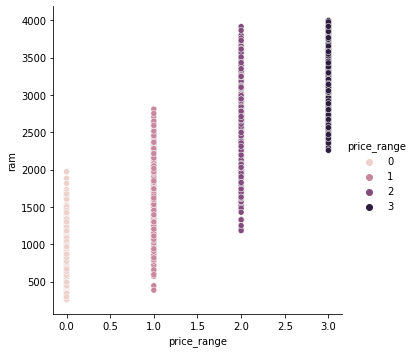
    


We can also see the gradual increase in the ram as the price range increases.

## Relation between Battery Power, Ram and Price Range


```python
sns.FacetGrid(data, hue='price_range', height=10).map(
    plt.scatter, 'ram', 'battery_power', alpha=0.6).add_legend()
plt.show()
```


    
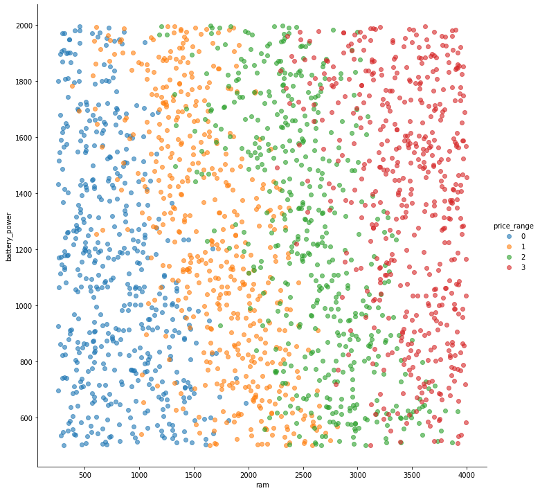
    


```python
# 3G related to ram and price range
plt.figure(figsize=(8, 8))
sns.boxplot(data=data, x="three_g", y="ram", hue="price_range")
plt.xlabel("3-G")
plt.ylabel("RAM")
plt.show()

# 4G related to ram and price range
plt.figure(figsize=(8, 8))
sns.boxplot(data=data, x="four_g", y="ram", hue="price_range")
plt.xlabel("4-G")
plt.ylabel("RAM")
plt.show()
```


    
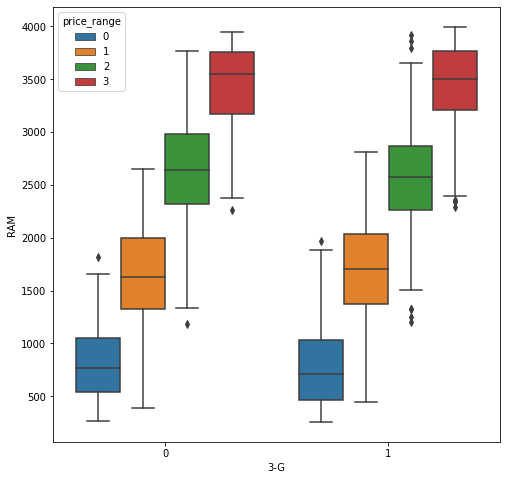
    


    
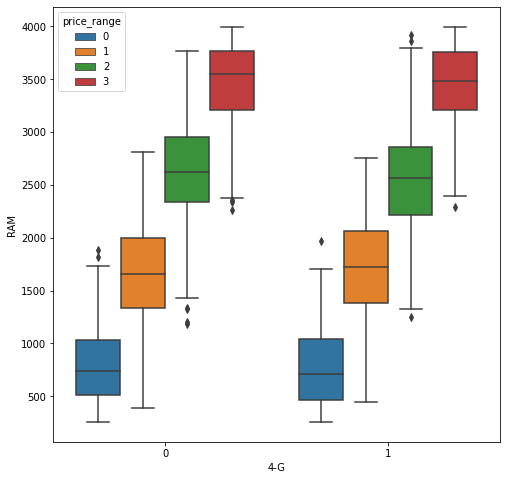
    


Here 0 stands for has NO 3G/4G and 1 represents that the phone HAS 3G/4G

## Cleaning the Data


```python
# To check for missing values
data.isnull().sum()
```


    battery_power    0
    blue             0
    clock_speed      0
    dual_sim         0
    fc               0
    four_g           0
    int_memory       0
    m_dep            0
    mobile_wt        0
    n_cores          0
    pc               0
    px_height        0
    px_width         0
    ram              0
    sc_h             0
    sc_w             0
    talk_time        0
    three_g          0
    touch_screen     0
    wifi             0
    price_range      0
    dtype: int64


```python
# calculate the sum of duplicate rows
print(data.duplicated().sum())
```

    0


The above results show that there are no null/duplicate values in the data set, also all values are numeric.

However, on further inspection of the data, I found out that some values for features like px_height (height of phone in pixels) and sc_w (width of the screen) were 0 which didn't really make sense, therefore, I decided to replace these "0" values with the median of the feature.


```python
data[data['px_height'] == 0]
```


<div>
<style scoped>
    .dataframe tbody tr th:only-of-type {
        vertical-align: middle;
    }

    .dataframe tbody tr th {
        vertical-align: top;
    }

    .dataframe thead th {
        text-align: right;
    }
</style>
<table border="1" class="dataframe">
  <thead>
    <tr style="text-align: right;">
      <th></th>
      <th>battery_power</th>
      <th>blue</th>
      <th>clock_speed</th>
      <th>dual_sim</th>
      <th>fc</th>
      <th>four_g</th>
      <th>int_memory</th>
      <th>m_dep</th>
      <th>mobile_wt</th>
      <th>n_cores</th>
      <th>...</th>
      <th>px_height</th>
      <th>px_width</th>
      <th>ram</th>
      <th>sc_h</th>
      <th>sc_w</th>
      <th>talk_time</th>
      <th>three_g</th>
      <th>touch_screen</th>
      <th>wifi</th>
      <th>price_range</th>
    </tr>
  </thead>
  <tbody>
    <tr>
      <th>1481</th>
      <td>1834</td>
      <td>0</td>
      <td>2.1</td>
      <td>0</td>
      <td>7</td>
      <td>1</td>
      <td>40</td>
      <td>0.1</td>
      <td>99</td>
      <td>4</td>
      <td>...</td>
      <td>0</td>
      <td>1987</td>
      <td>3692</td>
      <td>13</td>
      <td>0</td>
      <td>16</td>
      <td>1</td>
      <td>1</td>
      <td>0</td>
      <td>3</td>
    </tr>
    <tr>
      <th>1933</th>
      <td>897</td>
      <td>1</td>
      <td>2.0</td>
      <td>0</td>
      <td>3</td>
      <td>1</td>
      <td>2</td>
      <td>0.6</td>
      <td>154</td>
      <td>8</td>
      <td>...</td>
      <td>0</td>
      <td>994</td>
      <td>1958</td>
      <td>7</td>
      <td>5</td>
      <td>7</td>
      <td>1</td>
      <td>1</td>
      <td>0</td>
      <td>1</td>
    </tr>
  </tbody>
</table>
<p>2 rows × 21 columns</p>
</div>


```python
data['sc_w'].median()
```


    5.0


```python
data[data['sc_w'] == 0]
```


<div>
<style scoped>
    .dataframe tbody tr th:only-of-type {
        vertical-align: middle;
    }

    .dataframe tbody tr th {
        vertical-align: top;
    }

    .dataframe thead th {
        text-align: right;
    }
</style>
<table border="1" class="dataframe">
  <thead>
    <tr style="text-align: right;">
      <th></th>
      <th>battery_power</th>
      <th>blue</th>
      <th>clock_speed</th>
      <th>dual_sim</th>
      <th>fc</th>
      <th>four_g</th>
      <th>int_memory</th>
      <th>m_dep</th>
      <th>mobile_wt</th>
      <th>n_cores</th>
      <th>...</th>
      <th>px_height</th>
      <th>px_width</th>
      <th>ram</th>
      <th>sc_h</th>
      <th>sc_w</th>
      <th>talk_time</th>
      <th>three_g</th>
      <th>touch_screen</th>
      <th>wifi</th>
      <th>price_range</th>
    </tr>
  </thead>
  <tbody>
    <tr>
      <th>12</th>
      <td>1815</td>
      <td>0</td>
      <td>2.8</td>
      <td>0</td>
      <td>2</td>
      <td>0</td>
      <td>33</td>
      <td>0.6</td>
      <td>159</td>
      <td>4</td>
      <td>...</td>
      <td>607</td>
      <td>748</td>
      <td>1482</td>
      <td>18</td>
      <td>0</td>
      <td>2</td>
      <td>1</td>
      <td>0</td>
      <td>0</td>
      <td>1</td>
    </tr>
    <tr>
      <th>24</th>
      <td>503</td>
      <td>0</td>
      <td>1.2</td>
      <td>1</td>
      <td>5</td>
      <td>1</td>
      <td>8</td>
      <td>0.4</td>
      <td>111</td>
      <td>3</td>
      <td>...</td>
      <td>201</td>
      <td>1245</td>
      <td>2583</td>
      <td>11</td>
      <td>0</td>
      <td>12</td>
      <td>1</td>
      <td>0</td>
      <td>0</td>
      <td>1</td>
    </tr>
    <tr>
      <th>33</th>
      <td>1310</td>
      <td>1</td>
      <td>2.2</td>
      <td>1</td>
      <td>0</td>
      <td>1</td>
      <td>51</td>
      <td>0.6</td>
      <td>100</td>
      <td>4</td>
      <td>...</td>
      <td>178</td>
      <td>1919</td>
      <td>3845</td>
      <td>7</td>
      <td>0</td>
      <td>12</td>
      <td>1</td>
      <td>1</td>
      <td>0</td>
      <td>3</td>
    </tr>
    <tr>
      <th>42</th>
      <td>1253</td>
      <td>1</td>
      <td>0.5</td>
      <td>1</td>
      <td>5</td>
      <td>1</td>
      <td>5</td>
      <td>0.2</td>
      <td>152</td>
      <td>2</td>
      <td>...</td>
      <td>685</td>
      <td>714</td>
      <td>1878</td>
      <td>15</td>
      <td>0</td>
      <td>4</td>
      <td>1</td>
      <td>1</td>
      <td>0</td>
      <td>1</td>
    </tr>
    <tr>
      <th>50</th>
      <td>1547</td>
      <td>1</td>
      <td>3.0</td>
      <td>1</td>
      <td>2</td>
      <td>1</td>
      <td>14</td>
      <td>0.7</td>
      <td>198</td>
      <td>3</td>
      <td>...</td>
      <td>1042</td>
      <td>1832</td>
      <td>2059</td>
      <td>5</td>
      <td>0</td>
      <td>15</td>
      <td>1</td>
      <td>0</td>
      <td>1</td>
      <td>2</td>
    </tr>
    <tr>
      <th>...</th>
      <td>...</td>
      <td>...</td>
      <td>...</td>
      <td>...</td>
      <td>...</td>
      <td>...</td>
      <td>...</td>
      <td>...</td>
      <td>...</td>
      <td>...</td>
      <td>...</td>
      <td>...</td>
      <td>...</td>
      <td>...</td>
      <td>...</td>
      <td>...</td>
      <td>...</td>
      <td>...</td>
      <td>...</td>
      <td>...</td>
      <td>...</td>
    </tr>
    <tr>
      <th>1918</th>
      <td>772</td>
      <td>0</td>
      <td>1.0</td>
      <td>1</td>
      <td>0</td>
      <td>1</td>
      <td>23</td>
      <td>0.6</td>
      <td>97</td>
      <td>7</td>
      <td>...</td>
      <td>317</td>
      <td>1805</td>
      <td>2782</td>
      <td>7</td>
      <td>0</td>
      <td>17</td>
      <td>1</td>
      <td>0</td>
      <td>0</td>
      <td>2</td>
    </tr>
    <tr>
      <th>1920</th>
      <td>591</td>
      <td>1</td>
      <td>0.5</td>
      <td>1</td>
      <td>1</td>
      <td>1</td>
      <td>16</td>
      <td>0.9</td>
      <td>90</td>
      <td>6</td>
      <td>...</td>
      <td>892</td>
      <td>1603</td>
      <td>3746</td>
      <td>5</td>
      <td>0</td>
      <td>5</td>
      <td>1</td>
      <td>1</td>
      <td>0</td>
      <td>3</td>
    </tr>
    <tr>
      <th>1946</th>
      <td>590</td>
      <td>1</td>
      <td>1.2</td>
      <td>1</td>
      <td>0</td>
      <td>0</td>
      <td>32</td>
      <td>0.4</td>
      <td>141</td>
      <td>6</td>
      <td>...</td>
      <td>227</td>
      <td>509</td>
      <td>1817</td>
      <td>10</td>
      <td>0</td>
      <td>6</td>
      <td>0</td>
      <td>1</td>
      <td>0</td>
      <td>0</td>
    </tr>
    <tr>
      <th>1954</th>
      <td>686</td>
      <td>1</td>
      <td>2.7</td>
      <td>1</td>
      <td>0</td>
      <td>0</td>
      <td>36</td>
      <td>0.1</td>
      <td>194</td>
      <td>4</td>
      <td>...</td>
      <td>64</td>
      <td>745</td>
      <td>1503</td>
      <td>10</td>
      <td>0</td>
      <td>13</td>
      <td>0</td>
      <td>0</td>
      <td>0</td>
      <td>0</td>
    </tr>
    <tr>
      <th>1981</th>
      <td>1454</td>
      <td>0</td>
      <td>2.6</td>
      <td>0</td>
      <td>8</td>
      <td>0</td>
      <td>6</td>
      <td>0.4</td>
      <td>199</td>
      <td>3</td>
      <td>...</td>
      <td>698</td>
      <td>1018</td>
      <td>1300</td>
      <td>10</td>
      <td>0</td>
      <td>2</td>
      <td>0</td>
      <td>0</td>
      <td>1</td>
      <td>1</td>
    </tr>
  </tbody>
</table>
<p>180 rows × 21 columns</p>
</div>


```python
data[data['sc_w'] == 0].shape[0]
```


    180


There are 180 rows in the dataset where the sc_w feature is 0, therefore, I replaced these values with the median of the feature.


```python
data['sc_w'] = data['sc_w'].replace(0,data['sc_w'].mean())
```


```python
data[data['sc_w'] == 0].shape[0]
```


    0


```python
data['px_height'].median()
```


    564.0


```python
data[data['px_height'] == 0].shape[0]
```


    2


There are 2 rows in the dataset where the px_height feature is 0, therefore, I replaced these values with the median of the feature.


```python
data['px_height'] = data['px_height'].replace(0,data['px_height'].median())
```


```python
data[data['px_height'] == 0].shape[0]
```


    0


# GaussianNB

## Splitting the data into testing and training data sets using the train_test_split function from sklearn


```python
features = data.drop(columns=['price_range'])
target = data['price_range']
```

The Variance Inflation Factor is a measure to test collinearity of the data.

If the vif value is over 5, then the data is not suitable for training the model.


```python
vif=pd.DataFrame()
vif['features']=features.columns
vif['vif']=[variance_inflation_factor(features,i) for i in range(features.shape[1])]
vif.sort_values(by='vif',ascending=False)
```


<div>
<style scoped>
    .dataframe tbody tr th:only-of-type {
        vertical-align: middle;
    }

    .dataframe tbody tr th {
        vertical-align: top;
    }

    .dataframe thead th {
        text-align: right;
    }
</style>
<table border="1" class="dataframe">
  <thead>
    <tr style="text-align: right;">
      <th></th>
      <th>features</th>
      <th>vif</th>
    </tr>
  </thead>
  <tbody>
    <tr>
      <th>8</th>
      <td>mobile_wt</td>
      <td>12.965438</td>
    </tr>
    <tr>
      <th>12</th>
      <td>px_width</td>
      <td>11.752508</td>
    </tr>
    <tr>
      <th>14</th>
      <td>sc_h</td>
      <td>11.596572</td>
    </tr>
    <tr>
      <th>0</th>
      <td>battery_power</td>
      <td>8.063261</td>
    </tr>
    <tr>
      <th>17</th>
      <td>three_g</td>
      <td>6.178244</td>
    </tr>
    <tr>
      <th>10</th>
      <td>pc</td>
      <td>6.132723</td>
    </tr>
    <tr>
      <th>16</th>
      <td>talk_time</td>
      <td>4.865577</td>
    </tr>
    <tr>
      <th>15</th>
      <td>sc_w</td>
      <td>4.717619</td>
    </tr>
    <tr>
      <th>13</th>
      <td>ram</td>
      <td>4.704240</td>
    </tr>
    <tr>
      <th>9</th>
      <td>n_cores</td>
      <td>4.652279</td>
    </tr>
    <tr>
      <th>11</th>
      <td>px_height</td>
      <td>4.264051</td>
    </tr>
    <tr>
      <th>2</th>
      <td>clock_speed</td>
      <td>4.254660</td>
    </tr>
    <tr>
      <th>6</th>
      <td>int_memory</td>
      <td>3.973446</td>
    </tr>
    <tr>
      <th>7</th>
      <td>m_dep</td>
      <td>3.909933</td>
    </tr>
    <tr>
      <th>4</th>
      <td>fc</td>
      <td>3.395994</td>
    </tr>
    <tr>
      <th>5</th>
      <td>four_g</td>
      <td>3.191828</td>
    </tr>
    <tr>
      <th>3</th>
      <td>dual_sim</td>
      <td>2.014217</td>
    </tr>
    <tr>
      <th>19</th>
      <td>wifi</td>
      <td>2.010019</td>
    </tr>
    <tr>
      <th>18</th>
      <td>touch_screen</td>
      <td>1.986832</td>
    </tr>
    <tr>
      <th>1</th>
      <td>blue</td>
      <td>1.983706</td>
    </tr>
  </tbody>
</table>
</div>


As we can see, the VIF for the features is very high. So, we need to scale the features which have high VIF.


```python
scale = StandardScaler()
X_scaled=scale.fit_transform(features)
```


```python
vif=pd.DataFrame()
vif['features']=features.columns
vif['vif']=[variance_inflation_factor(X_scaled,i) for i in range(X_scaled.shape[1])]
vif.sort_values(by='vif',ascending=False)
```


<div>
<style scoped>
    .dataframe tbody tr th:only-of-type {
        vertical-align: middle;
    }

    .dataframe tbody tr th {
        vertical-align: top;
    }

    .dataframe thead th {
        text-align: right;
    }
</style>
<table border="1" class="dataframe">
  <thead>
    <tr style="text-align: right;">
      <th></th>
      <th>features</th>
      <th>vif</th>
    </tr>
  </thead>
  <tbody>
    <tr>
      <th>10</th>
      <td>pc</td>
      <td>1.697049</td>
    </tr>
    <tr>
      <th>4</th>
      <td>fc</td>
      <td>1.695222</td>
    </tr>
    <tr>
      <th>5</th>
      <td>four_g</td>
      <td>1.530114</td>
    </tr>
    <tr>
      <th>17</th>
      <td>three_g</td>
      <td>1.528953</td>
    </tr>
    <tr>
      <th>11</th>
      <td>px_height</td>
      <td>1.365827</td>
    </tr>
    <tr>
      <th>12</th>
      <td>px_width</td>
      <td>1.359660</td>
    </tr>
    <tr>
      <th>14</th>
      <td>sc_h</td>
      <td>1.344472</td>
    </tr>
    <tr>
      <th>15</th>
      <td>sc_w</td>
      <td>1.340456</td>
    </tr>
    <tr>
      <th>3</th>
      <td>dual_sim</td>
      <td>1.012172</td>
    </tr>
    <tr>
      <th>1</th>
      <td>blue</td>
      <td>1.011162</td>
    </tr>
    <tr>
      <th>16</th>
      <td>talk_time</td>
      <td>1.010118</td>
    </tr>
    <tr>
      <th>0</th>
      <td>battery_power</td>
      <td>1.009327</td>
    </tr>
    <tr>
      <th>6</th>
      <td>int_memory</td>
      <td>1.008817</td>
    </tr>
    <tr>
      <th>9</th>
      <td>n_cores</td>
      <td>1.008151</td>
    </tr>
    <tr>
      <th>13</th>
      <td>ram</td>
      <td>1.008143</td>
    </tr>
    <tr>
      <th>19</th>
      <td>wifi</td>
      <td>1.007628</td>
    </tr>
    <tr>
      <th>7</th>
      <td>m_dep</td>
      <td>1.006248</td>
    </tr>
    <tr>
      <th>18</th>
      <td>touch_screen</td>
      <td>1.006010</td>
    </tr>
    <tr>
      <th>2</th>
      <td>clock_speed</td>
      <td>1.005866</td>
    </tr>
    <tr>
      <th>8</th>
      <td>mobile_wt</td>
      <td>1.004510</td>
    </tr>
  </tbody>
</table>
</div>


We can see how the vif values have clearly been affected by the scaling of the features.

### Since,VIF is less than 5.
### So, There is no multicollinearity.

Thus we can now used the scaled dataset (X_scaled) to train our model.


```python
# splitting data into train and test

# data['ram_core'] = data['ram'] / data['n_cores']

X_scaled = pd.DataFrame(X_scaled,columns=[features.columns])

X_train, X_test, y_train, y_test = train_test_split(X_scaled, target, test_size=0.25, random_state=0, stratify=target)

print(X_train.shape)
print(X_test.shape)
print(y_train.shape)
print(y_test.shape)

cols = features.columns
cols

```

    (1491, 20)
    (497, 20)
    (1491,)
    (497,)


    Index(['battery_power', 'blue', 'clock_speed', 'dual_sim', 'fc', 'four_g',
           'int_memory', 'm_dep', 'mobile_wt', 'n_cores', 'pc', 'px_height',
           'px_width', 'ram', 'sc_h', 'sc_w', 'talk_time', 'three_g',
           'touch_screen', 'wifi'],
          dtype='object')


## Running naive bayes on the training data without Feature Engineering


```python
# Running naive bayes on the training data

# Create a Gaussian Classifier
model = GaussianNB()

# Train the model using the training sets
model.fit(X_train, y_train)


# Predict the response for test dataset
y_pred = model.predict(X_test)


# Generating the confusion matrix
cnf_matrix = confusion_matrix(y_test, y_pred)

```


```python
# https://stackoverflow.com/a/59326862

# A custom function to plot the ROC curve and calculate the AUC

def plot_multiclass_roc(y_prob, X_test, y_test, n_classes, figsize=(17, 6)):

    # structures
    fpr = dict()
    tpr = dict()
    roc_auc = dict()

    # calculate dummies once
    y_test_dummies = pd.get_dummies(y_test, drop_first=False).values
    for i in range(n_classes):
        fpr[i], tpr[i], _ = roc_curve(y_test_dummies[:, i], y_prob[:, i])
        roc_auc[i] = auc(fpr[i], tpr[i])

    # roc for each class
    fig, ax = plt.subplots(figsize=figsize)
    ax.plot([0, 1], [0, 1], linestyle='--')
    ax.set_xlim([0.0, 1.0])
    ax.set_ylim([0.0, 1.05])
    ax.set_xlabel('False Positive Rate')
    ax.set_ylabel('True Positive Rate')
    ax.set_title('Receiver operating characteristic example')
    for i in range(n_classes):
        ax.plot(fpr[i], tpr[i], label='ROC curve (area = %0.2f) for label %i' % (roc_auc[i], i))
    ax.legend(loc="best")
    ax.grid(alpha=.4)
    sns.despine()
    plt.show()
    
# Function to calculate various metrics using the confusion matrix and a library called pycm

def metrics(y_test, y_pred ,cnf_matrix, model, X_test=X_test):

    n_classes = len(y_test.unique())
    y_prob = model.predict_proba(X_test)

    cm = ConfusionMatrix(np.array(y_test), np.array(y_pred))
    metric_strings = []
    # Model Accuracy, how often is the classifier correct?
    metric_strings.append(f"Accuracy: {accuracy_score(y_test, y_pred):.3f}")

    # Model Precision
    metric_strings.append(f"Precision (weighted): {precision_score(y_test, y_pred, average='weighted'):.3f}")
    metric_strings.append(f"Precision (macro): {precision_score(y_test, y_pred, average='macro'):.3f}")
    metric_strings.append(f"Precision (micro): {precision_score(y_test, y_pred, average='micro'):.3f}")

    # Model Recall
    metric_strings.append(f"Recall (weighted): {recall_score(y_test, y_pred, average='weighted'):.3f}")
    metric_strings.append(f"Recall (macro): {recall_score(y_test, y_pred, average='macro'):.3f}")
    metric_strings.append(f"Recall (micro): {recall_score(y_test, y_pred, average='micro'):.3f}")

    # Model F1 Score
    metric_strings.append(f"F1 Score (weighted): {f1_score(y_test, y_pred, average='weighted'):.3f}")
    metric_strings.append(f"F1 Score (macro): {f1_score(y_test, y_pred, average='macro'):.3f}")
    metric_strings.append(f"F1 Score (micro): {f1_score(y_test, y_pred, average='micro'):.3f}")

    # Mean Squared Error
    metric_strings.append(f"Mean Squared Error: {mean_squared_error(y_test, y_pred):.3f}")

    # Mean Absolute Error
    metric_strings.append(f"Mean Absolute Error: {mean_absolute_error(y_test, y_pred):.3f}")

    metrics = cm.class_stat
    
    table_metrics = 'TPR FPR TNR FNR ERR ACC F1 AUC'.split()

    markdown = '| Metric | 0 | 1 | 2 | 3 |\n| ----------- | ----------- | ----------- | ----------- | ----------- |\n'
    for metric in table_metrics:
        markdown += '| ' + metric + ' | '
        for i in range(n_classes):
            markdown += f'{metrics[metric][i]:.3f} | '
        markdown += '\n'

    # ROC AUC Score
    metric_strings.append(f"ROC AUC Score: {roc_auc_score(y_test, y_prob, multi_class='ovo'):.3f}")

    output = ""
    for metric in metric_strings:
        output += "## " + metric + "\n"
    
    printmd(output)

    # Model Classification Report
    print("Classification Report:\n", classification_report(y_test, y_pred))

    # Model Confusion Matrix
    print("Confusion Matrix:\n", cnf_matrix)

    printmd(markdown)

    plt.figure(figsize=(10, 7))
    sns.heatmap(cnf_matrix)
    plt.show()

    plot_multiclass_roc(y_prob, X_test, y_test, n_classes=n_classes, figsize=(8, 8))
```


```python
metrics(y_test=y_test, y_pred=y_pred, cnf_matrix=cnf_matrix, model=model)
```


## Accuracy: 0.831
## Precision (weighted): 0.833
## Precision (macro): 0.833
## Precision (micro): 0.831
## Recall (weighted): 0.831
## Recall (macro): 0.831
## Recall (micro): 0.831
## F1 Score (weighted): 0.832
## F1 Score (macro): 0.831
## F1 Score (micro): 0.831
## Mean Squared Error: 0.169
## Mean Absolute Error: 0.169
## ROC AUC Score: 0.957


    Classification Report:
                   precision    recall  f1-score   support
    
               0       0.93      0.88      0.90       124
               1       0.73      0.78      0.75       124
               2       0.76      0.73      0.75       124
               3       0.91      0.93      0.92       125
    
        accuracy                           0.83       497
       macro avg       0.83      0.83      0.83       497
    weighted avg       0.83      0.83      0.83       497
    
    Confusion Matrix:
     [[109  15   0   0]
     [  8  97  19   0]
     [  0  21  91  12]
     [  0   0   9 116]]


| Metric | 0 | 1 | 2 | 3 |
| ----------- | ----------- | ----------- | ----------- | ----------- |
| TPR | 0.879 | 0.782 | 0.734 | 0.928 | 
| FPR | 0.021 | 0.097 | 0.075 | 0.032 | 
| TNR | 0.979 | 0.903 | 0.925 | 0.968 | 
| FNR | 0.121 | 0.218 | 0.266 | 0.072 | 
| ERR | 0.046 | 0.127 | 0.123 | 0.042 | 
| ACC | 0.954 | 0.873 | 0.877 | 0.958 | 
| F1 | 0.905 | 0.755 | 0.749 | 0.917 | 
| AUC | 0.929 | 0.843 | 0.829 | 0.948 | 


    
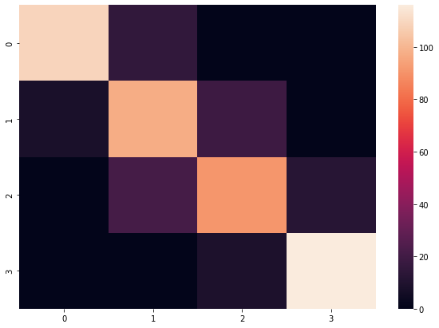
    


    
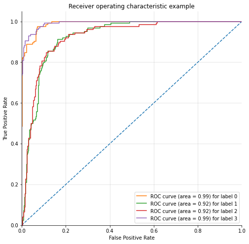
    


## Running Gaussian Naive Bayes after Feature Engineering

### Feature Selection

#### Recursive feature elimination (RFE) with RandomForestClassifier (OLD METHOD)


#### New feature selection method uses a loop over the highly correlated features to find the features that give the highest accuracy. (NEW METHOD)


```python
from sklearn.feature_selection import RFE
from sklearn.ensemble import RandomForestClassifier

clf_rf = RandomForestClassifier()

accuracy_scores = []
number_of_features = []

for i in range(len(features.columns)+1, 1, -1):
    # rfe = RFE(estimator=clf_rf, n_features_to_select=i, step=1)
    # rfe = rfe.fit(X_train, y_train)

    # print(f'Chosen best {i} feature by rfe:', X_train.columns[rfe.support_])
    
    features_selected = corr_matrix_abs['price_range'].abs().nlargest(i+1)[1:].index

    # X_train_pick = X_train[X_train.columns[rfe.support_]]
    # X_test_pick = X_test[X_train.columns[rfe.support_]]
    
    X_train_pick = X_train[features_selected]
    X_test_pick = X_test[features_selected]

    # Train the model using the training sets
    model.fit(X_train_pick, y_train)

    # Predict the response for test dataset
    y_pred = model.predict(X_test_pick)

    current_accuracy = accuracy_score(y_test, y_pred)
    printmd(f'## For {i} selected features, the accuracy score is {current_accuracy:.3f}')
    number_of_features.append(i)
    accuracy_scores.append(current_accuracy)


plt.plot(number_of_features, accuracy_scores)
plt.xlabel('Number of features')
plt.ylabel('Accuracy')
plt.show()

highest_accuracy_feature_count = number_of_features[accuracy_scores.index(max(accuracy_scores))]
print(highest_accuracy_feature_count)

rfe = RFE(estimator=clf_rf, n_features_to_select=highest_accuracy_feature_count, step=1)
rfe = rfe.fit(X_train, y_train)

print(f'Chosen best {highest_accuracy_feature_count} features by rfe:\n', X_train.columns[rfe.support_])

X_train_pick = X_train[X_train.columns[rfe.support_]]
X_test_pick = X_test[X_train.columns[rfe.support_]]

# Train the model using the training sets
model.fit(X_train_pick, y_train)

# Predict the response for test dataset
y_pred = model.predict(X_test_pick)

# accuracy_scores.append(current_accuracy)
cnf_matrix = confusion_matrix(y_test, y_pred)

metrics(y_test=y_test, y_pred=y_pred, cnf_matrix=cnf_matrix,
        model=model, X_test=X_test_pick)

```


## For 21 selected features, the accuracy score is 0.831


## For 20 selected features, the accuracy score is 0.831


## For 19 selected features, the accuracy score is 0.829


## For 18 selected features, the accuracy score is 0.829


## For 17 selected features, the accuracy score is 0.823


## For 16 selected features, the accuracy score is 0.825


## For 15 selected features, the accuracy score is 0.827


## For 14 selected features, the accuracy score is 0.825


## For 13 selected features, the accuracy score is 0.823


## For 12 selected features, the accuracy score is 0.823


## For 11 selected features, the accuracy score is 0.819


## For 10 selected features, the accuracy score is 0.823


## For 9 selected features, the accuracy score is 0.819


## For 8 selected features, the accuracy score is 0.817


## For 7 selected features, the accuracy score is 0.819


## For 6 selected features, the accuracy score is 0.823


## For 5 selected features, the accuracy score is 0.817


## For 4 selected features, the accuracy score is 0.817


## For 3 selected features, the accuracy score is 0.809


## For 2 selected features, the accuracy score is 0.801


    
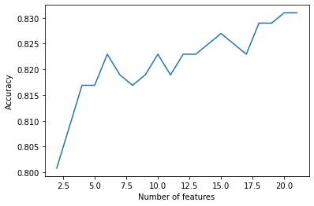
    


    21
    Chosen best 21 features by rfe:
     MultiIndex([('battery_power',),
                (         'blue',),
                (  'clock_speed',),
                (     'dual_sim',),
                (           'fc',),
                (       'four_g',),
                (   'int_memory',),
                (        'm_dep',),
                (    'mobile_wt',),
                (      'n_cores',),
                (           'pc',),
                (    'px_height',),
                (     'px_width',),
                (          'ram',),
                (         'sc_h',),
                (         'sc_w',),
                (    'talk_time',),
                (      'three_g',),
                ( 'touch_screen',),
                (         'wifi',)],
               )


## Accuracy: 0.831
## Precision (weighted): 0.833
## Precision (macro): 0.833
## Precision (micro): 0.831
## Recall (weighted): 0.831
## Recall (macro): 0.831
## Recall (micro): 0.831
## F1 Score (weighted): 0.832
## F1 Score (macro): 0.831
## F1 Score (micro): 0.831
## Mean Squared Error: 0.169
## Mean Absolute Error: 0.169
## ROC AUC Score: 0.957


    Classification Report:
                   precision    recall  f1-score   support
    
               0       0.93      0.88      0.90       124
               1       0.73      0.78      0.75       124
               2       0.76      0.73      0.75       124
               3       0.91      0.93      0.92       125
    
        accuracy                           0.83       497
       macro avg       0.83      0.83      0.83       497
    weighted avg       0.83      0.83      0.83       497
    
    Confusion Matrix:
     [[109  15   0   0]
     [  8  97  19   0]
     [  0  21  91  12]
     [  0   0   9 116]]


| Metric | 0 | 1 | 2 | 3 |
| ----------- | ----------- | ----------- | ----------- | ----------- |
| TPR | 0.879 | 0.782 | 0.734 | 0.928 | 
| FPR | 0.021 | 0.097 | 0.075 | 0.032 | 
| TNR | 0.979 | 0.903 | 0.925 | 0.968 | 
| FNR | 0.121 | 0.218 | 0.266 | 0.072 | 
| ERR | 0.046 | 0.127 | 0.123 | 0.042 | 
| ACC | 0.954 | 0.873 | 0.877 | 0.958 | 
| F1 | 0.905 | 0.755 | 0.749 | 0.917 | 
| AUC | 0.929 | 0.843 | 0.829 | 0.948 | 


    

    


    

    


# SVC

## Testing with SVC classifier


```python
# Running SVC
svc = SVC(kernel='linear', probability=True)
# model = KNeighborsClassifier(n_neighbors=5)

# Train the model using the training sets
svc.fit(X_train, y_train)

# Predict the response for test dataset
y_pred = svc.predict(X_test)

y_train_pred = svc.predict(X_train)

cnf_matrix = confusion_matrix(y_test, y_pred)

cnf_matrix
```


    array([[120,   4,   0,   0],
           [  6, 113,   5,   0],
           [  0,   1, 120,   3],
           [  0,   0,   3, 122]])


```python
metrics(y_test=y_test, y_pred=y_pred, cnf_matrix=cnf_matrix, model=svc, X_test=X_test)
```


## Accuracy: 0.956
## Precision (weighted): 0.956
## Precision (macro): 0.956
## Precision (micro): 0.956
## Recall (weighted): 0.956
## Recall (macro): 0.956
## Recall (micro): 0.956
## F1 Score (weighted): 0.956
## F1 Score (macro): 0.956
## F1 Score (micro): 0.956
## Mean Squared Error: 0.044
## Mean Absolute Error: 0.044
## ROC AUC Score: 0.998


    Classification Report:
                   precision    recall  f1-score   support
    
               0       0.95      0.97      0.96       124
               1       0.96      0.91      0.93       124
               2       0.94      0.97      0.95       124
               3       0.98      0.98      0.98       125
    
        accuracy                           0.96       497
       macro avg       0.96      0.96      0.96       497
    weighted avg       0.96      0.96      0.96       497
    
    Confusion Matrix:
     [[120   4   0   0]
     [  6 113   5   0]
     [  0   1 120   3]
     [  0   0   3 122]]


| Metric | 0 | 1 | 2 | 3 |
| ----------- | ----------- | ----------- | ----------- | ----------- |
| TPR | 0.968 | 0.911 | 0.968 | 0.976 | 
| FPR | 0.016 | 0.013 | 0.021 | 0.008 | 
| TNR | 0.984 | 0.987 | 0.979 | 0.992 | 
| FNR | 0.032 | 0.089 | 0.032 | 0.024 | 
| ERR | 0.020 | 0.032 | 0.024 | 0.012 | 
| ACC | 0.980 | 0.968 | 0.976 | 0.988 | 
| F1 | 0.960 | 0.934 | 0.952 | 0.976 | 
| AUC | 0.976 | 0.949 | 0.973 | 0.984 | 


    
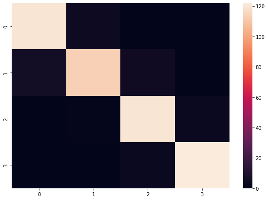
    


    
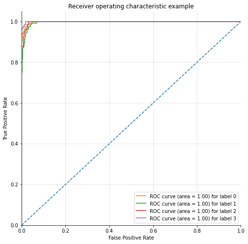
    


## SVC Feature Selection using Recursive Feature Elemination using Cross Validation


```python
from sklearn.model_selection import StratifiedKFold
from sklearn.feature_selection import RFECV

# Create the RFE object and compute a cross-validated score.
svc = SVC(kernel="linear")

# The "accuracy" scoring shows the proportion of correct classifications

min_features_to_select = 1  # Minimum number of features to consider
rfecv = RFECV(estimator=svc, step=1, cv=StratifiedKFold(2),
              scoring='accuracy',
              min_features_to_select=min_features_to_select)
rfecv.fit(X_train, y_train)

print("Optimal number of features : %d" % rfecv.n_features_)

# Plot number of features VS. cross-validation scores
plt.figure()
plt.xlabel("Number of features selected")
plt.ylabel("Cross validation score (accuracy)")
plt.plot(range(min_features_to_select,
               len(rfecv.grid_scores_) + min_features_to_select),
         rfecv.grid_scores_)
plt.show()

X_train_pick_cv = X_train[X_train.columns[rfecv.support_]]
X_test_pick_cv = X_test[X_train.columns[rfecv.support_]]

X_train.columns[rfecv.support_]
```

    Optimal number of features : 5


    
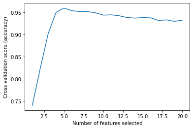
    


    MultiIndex([('battery_power',),
                (    'mobile_wt',),
                (    'px_height',),
                (     'px_width',),
                (          'ram',)],
               )


```python
# Running SVC
svc = SVC(kernel='linear', probability=True)
# model = KNeighborsClassifier(n_neighbors=5)

# Train the model using the training sets
svc.fit(X_train_pick_cv, y_train)


# Predict the response for test dataset
y_pred = svc.predict(X_test_pick_cv)


cnf_matrix = confusion_matrix(y_test, y_pred)
```


```python
metrics(y_test=y_test, y_pred=y_pred, cnf_matrix=cnf_matrix, model=svc, X_test=X_test_pick_cv)
```


## Accuracy: 0.984
## Precision (weighted): 0.984
## Precision (macro): 0.984
## Precision (micro): 0.984
## Recall (weighted): 0.984
## Recall (macro): 0.984
## Recall (micro): 0.984
## F1 Score (weighted): 0.984
## F1 Score (macro): 0.984
## F1 Score (micro): 0.984
## Mean Squared Error: 0.016
## Mean Absolute Error: 0.016
## ROC AUC Score: 0.999


    Classification Report:
                   precision    recall  f1-score   support
    
               0       0.98      0.99      0.98       124
               1       0.98      0.96      0.97       124
               2       0.98      0.98      0.98       124
               3       1.00      1.00      1.00       125
    
        accuracy                           0.98       497
       macro avg       0.98      0.98      0.98       497
    weighted avg       0.98      0.98      0.98       497
    
    Confusion Matrix:
     [[123   1   0   0]
     [  3 119   2   0]
     [  0   2 122   0]
     [  0   0   0 125]]


| Metric | 0 | 1 | 2 | 3 |
| ----------- | ----------- | ----------- | ----------- | ----------- |
| TPR | 0.992 | 0.960 | 0.984 | 1.000 | 
| FPR | 0.008 | 0.008 | 0.005 | 0.000 | 
| TNR | 0.992 | 0.992 | 0.995 | 1.000 | 
| FNR | 0.008 | 0.040 | 0.016 | 0.000 | 
| ERR | 0.008 | 0.016 | 0.008 | 0.000 | 
| ACC | 0.992 | 0.984 | 0.992 | 1.000 | 
| F1 | 0.984 | 0.967 | 0.984 | 1.000 | 
| AUC | 0.992 | 0.976 | 0.989 | 1.000 | 


    
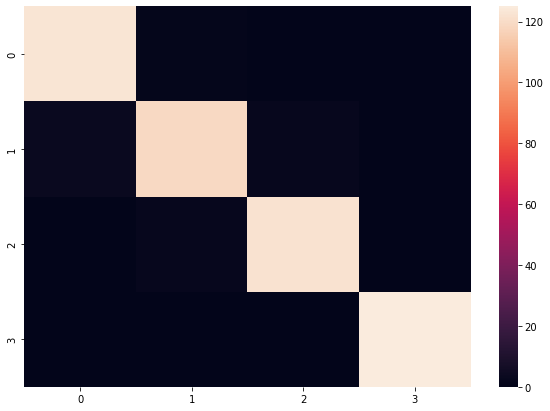
    


    
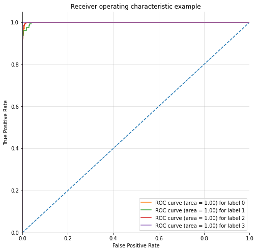
    


# DecisionTreeClassifier


```python
from sklearn.tree import DecisionTreeClassifier

y = data['price_range']
X = data.drop("price_range", axis=1)
X_train, X_test, y_train, y_test = train_test_split(X, y, test_size=0.2, random_state=0, stratify=y)
model = DecisionTreeClassifier(random_state=0)
model.fit(X_train, y_train)


# Predict the response for test dataset
y_pred = model.predict(X_test)


cnf_matrix = confusion_matrix(y_test, y_pred)


metrics(y_test=y_test, y_pred=y_pred, cnf_matrix=cnf_matrix, model=model, X_test=X_test)
```


## Accuracy: 0.812
## Precision (weighted): 0.814
## Precision (macro): 0.814
## Precision (micro): 0.812
## Recall (weighted): 0.812
## Recall (macro): 0.812
## Recall (micro): 0.812
## F1 Score (weighted): 0.813
## F1 Score (macro): 0.813
## F1 Score (micro): 0.812
## Mean Squared Error: 0.188
## Mean Absolute Error: 0.188
## ROC AUC Score: 0.874


    Classification Report:
                   precision    recall  f1-score   support
    
               0       0.87      0.85      0.86        99
               1       0.72      0.77      0.74       100
               2       0.77      0.76      0.76        99
               3       0.91      0.87      0.89       100
    
        accuracy                           0.81       398
       macro avg       0.81      0.81      0.81       398
    weighted avg       0.81      0.81      0.81       398
    
    Confusion Matrix:
     [[84 15  0  0]
     [13 77 10  0]
     [ 0 15 75  9]
     [ 0  0 13 87]]


| Metric | 0 | 1 | 2 | 3 |
| ----------- | ----------- | ----------- | ----------- | ----------- |
| TPR | 0.848 | 0.770 | 0.758 | 0.870 | 
| FPR | 0.043 | 0.101 | 0.077 | 0.030 | 
| TNR | 0.957 | 0.899 | 0.923 | 0.970 | 
| FNR | 0.152 | 0.230 | 0.242 | 0.130 | 
| ERR | 0.070 | 0.133 | 0.118 | 0.055 | 
| ACC | 0.930 | 0.867 | 0.882 | 0.945 | 
| F1 | 0.857 | 0.744 | 0.761 | 0.888 | 
| AUC | 0.903 | 0.835 | 0.840 | 0.920 | 


    
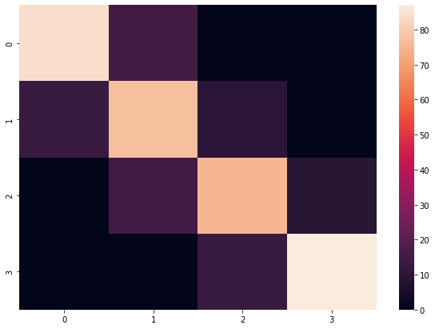
    


    
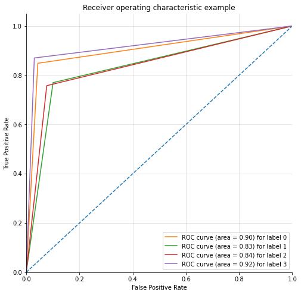
    


```python
dtc = DecisionTreeClassifier(max_depth=20, random_state=0)

# The "accuracy" scoring shows the proportion of correct classifications

min_features_to_select = 1  # Minimum number of features to consider
rfecv = RFECV(estimator=dtc, step=1, cv=StratifiedKFold(2),
              scoring='accuracy',
              min_features_to_select=min_features_to_select)
rfecv.fit(X_train, y_train)

print("Optimal number of features : %d" % rfecv.n_features_)

# Plot number of features VS. cross-validation scores
plt.figure()
plt.xlabel("Number of features selected")
plt.ylabel("Cross validation score (accuracy)")
plt.plot(range(min_features_to_select,
               len(rfecv.grid_scores_) + min_features_to_select),
         rfecv.grid_scores_)
plt.show()

X_train_pick_cv = X_train[X_train.columns[rfecv.support_]]
X_test_pick_cv = X_test[X_train.columns[rfecv.support_]]

X_train.columns[rfecv.support_]
```

    Optimal number of features : 4


    
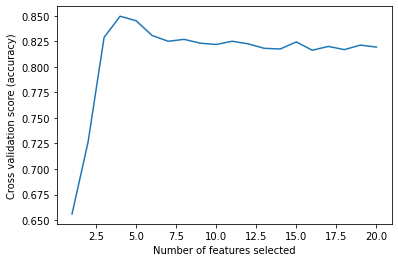
    


    Index(['battery_power', 'px_height', 'px_width', 'ram'], dtype='object')


```python
model = DecisionTreeClassifier(max_depth=20, random_state=0)
model.fit(X_train_pick_cv, y_train)


# Predict the response for test dataset
y_pred = model.predict(X_test_pick_cv)


cnf_matrix = confusion_matrix(y_test, y_pred)


metrics(y_test=y_test, y_pred=y_pred, cnf_matrix=cnf_matrix, model=model, X_test=X_test_pick_cv)
```


## Accuracy: 0.882
## Precision (weighted): 0.882
## Precision (macro): 0.882
## Precision (micro): 0.882
## Recall (weighted): 0.882
## Recall (macro): 0.882
## Recall (micro): 0.882
## F1 Score (weighted): 0.882
## F1 Score (macro): 0.882
## F1 Score (micro): 0.882
## Mean Squared Error: 0.118
## Mean Absolute Error: 0.118
## ROC AUC Score: 0.921


    Classification Report:
                   precision    recall  f1-score   support
    
               0       0.91      0.95      0.93        99
               1       0.84      0.85      0.85       100
               2       0.84      0.82      0.83        99
               3       0.93      0.91      0.92       100
    
        accuracy                           0.88       398
       macro avg       0.88      0.88      0.88       398
    weighted avg       0.88      0.88      0.88       398
    
    Confusion Matrix:
     [[94  5  0  0]
     [ 9 85  6  0]
     [ 0 11 81  7]
     [ 0  0  9 91]]


| Metric | 0 | 1 | 2 | 3 |
| ----------- | ----------- | ----------- | ----------- | ----------- |
| TPR | 0.949 | 0.850 | 0.818 | 0.910 | 
| FPR | 0.030 | 0.054 | 0.050 | 0.023 | 
| TNR | 0.970 | 0.946 | 0.950 | 0.977 | 
| FNR | 0.051 | 0.150 | 0.182 | 0.090 | 
| ERR | 0.035 | 0.078 | 0.083 | 0.040 | 
| ACC | 0.965 | 0.922 | 0.917 | 0.960 | 
| F1 | 0.931 | 0.846 | 0.831 | 0.919 | 
| AUC | 0.960 | 0.898 | 0.884 | 0.943 | 


    
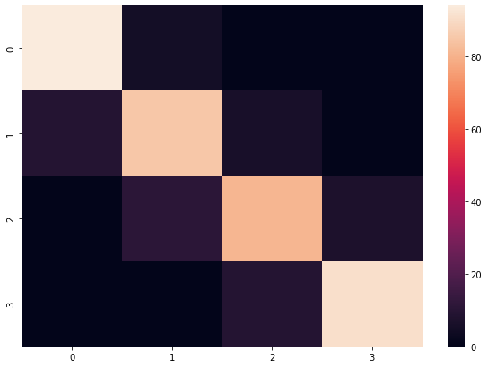
    


    
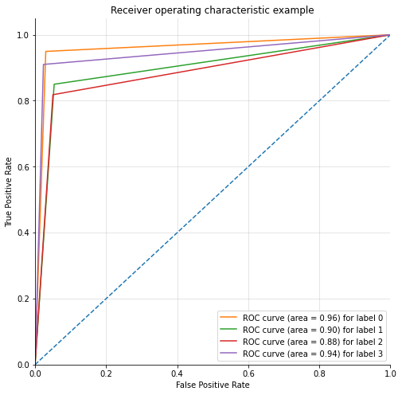
    


## Creating new datasets for each class of the target variable


```python
# one hot encode target
from sklearn.preprocessing import OneHotEncoder
encoder = OneHotEncoder()
target_encoded = encoder.fit_transform(target.values.reshape(-1, 1)).toarray()
target_encoded
```


    array([[0., 1., 0., 0.],
           [0., 0., 1., 0.],
           [0., 0., 1., 0.],
           ...,
           [0., 0., 0., 1.],
           [1., 0., 0., 0.],
           [0., 0., 0., 1.]])


```python
data_sets = []
for class_name in encoder.categories_[0]:
    data_copy = data.copy()
    data_copy['price_range'] = target_encoded[:, int(class_name)]
    data_sets.append(data_copy)
# data_test = data['price_range'] = target_encoded
```


```python
for data_set in data_sets:
    print(data_set.shape)
```

    (1988, 21)
    (1988, 21)
    (1988, 21)
    (1988, 21)


After one hot encoding, I was successfully able to create new datasets for each class of the target variable.


```python
corr_matrices = []
corr_matrices_abs = []
for class_name, data_set in enumerate(data_sets):
    corr_matrices.append(data_set.corr())
    corr_matrices_abs.append(data_set.corr().abs())
    plt.figure(figsize=(10,10))
    sns.heatmap(data_set.corr(), square=True, cmap='Purples')
    plt.title("Correlation Matrix for Class {}".format(class_name))
    plt.show()
```


    
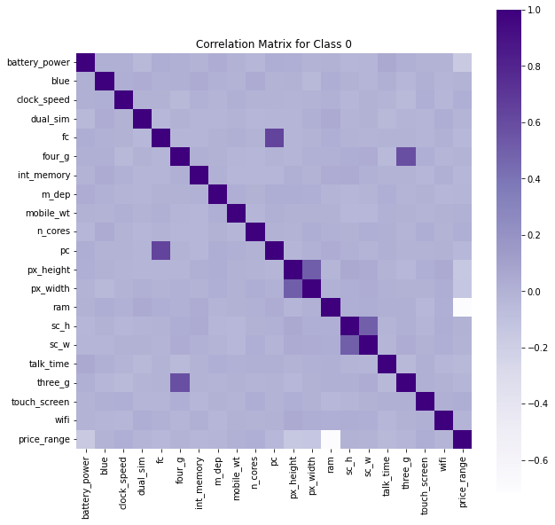
    


    
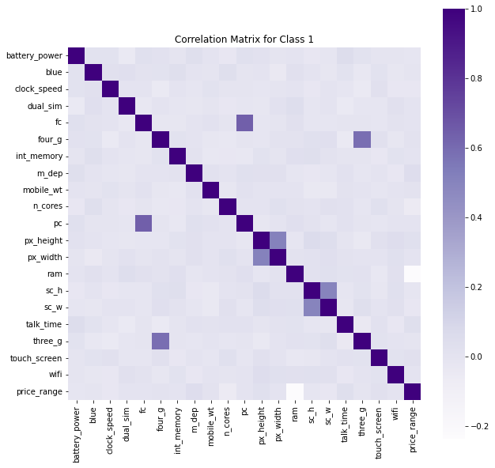
    


    
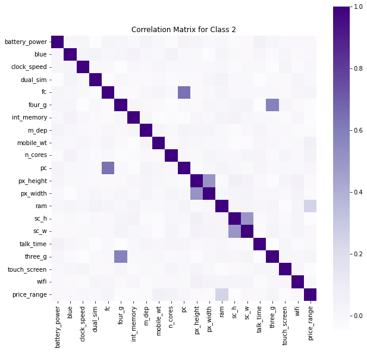
    


    

    


### Class 0


```python
print(corr_matrices[0]['price_range'].sort_values(ascending=False))
```

    price_range      1.000000
    touch_screen     0.024999
    clock_speed      0.019534
    n_cores          0.016768
    mobile_wt        0.005423
    sc_h             0.002498
    sc_w            -0.003846
    four_g          -0.005187
    blue            -0.008729
    dual_sim        -0.012768
    wifi            -0.012776
    m_dep           -0.020148
    three_g         -0.022444
    int_memory      -0.025282
    pc              -0.034993
    fc              -0.035068
    talk_time       -0.040303
    px_width        -0.134772
    px_height       -0.142258
    battery_power   -0.159446
    ram             -0.712942
    Name: price_range, dtype: float64


```python
print(corr_matrices_abs[0]['price_range'].sort_values(ascending=False))
```

    price_range      1.000000
    ram              0.712942
    battery_power    0.159446
    px_height        0.142258
    px_width         0.134772
    talk_time        0.040303
    fc               0.035068
    pc               0.034993
    int_memory       0.025282
    touch_screen     0.024999
    three_g          0.022444
    m_dep            0.020148
    clock_speed      0.019534
    n_cores          0.016768
    wifi             0.012776
    dual_sim         0.012768
    blue             0.008729
    mobile_wt        0.005423
    four_g           0.005187
    sc_w             0.003846
    sc_h             0.002498
    Name: price_range, dtype: float64


### Class 1


```python
print(corr_matrices[1]['price_range'].sort_values(ascending=False))
```

    price_range      1.000000e+00
    m_dep            4.391021e-02
    talk_time        3.442642e-02
    px_height        2.754989e-02
    touch_screen     2.149118e-02
    mobile_wt        5.775134e-03
    four_g           5.231970e-03
    fc               4.267822e-03
    pc               6.738107e-04
    dual_sim        -3.727883e-17
    px_width        -2.063280e-03
    wifi            -2.323459e-03
    int_memory      -2.451713e-03
    blue            -5.227732e-03
    three_g         -5.444400e-03
    sc_h            -1.495305e-02
    battery_power   -1.503219e-02
    clock_speed     -2.517932e-02
    sc_w            -2.788588e-02
    n_cores         -5.505419e-02
    ram             -2.362511e-01
    Name: price_range, dtype: float64


```python
print(corr_matrices_abs[1]['price_range'].sort_values(ascending=False))
```

    price_range      1.000000e+00
    ram              2.362511e-01
    n_cores          5.505419e-02
    m_dep            4.391021e-02
    talk_time        3.442642e-02
    sc_w             2.788588e-02
    px_height        2.754989e-02
    clock_speed      2.517932e-02
    touch_screen     2.149118e-02
    battery_power    1.503219e-02
    sc_h             1.495305e-02
    mobile_wt        5.775134e-03
    three_g          5.444400e-03
    four_g           5.231970e-03
    blue             5.227732e-03
    fc               4.267822e-03
    int_memory       2.451713e-03
    wifi             2.323459e-03
    px_width         2.063280e-03
    pc               6.738107e-04
    dual_sim         3.727883e-17
    Name: price_range, dtype: float64


### Class 2


```python
print(corr_matrices[2]['price_range'].sort_values(ascending=False))
```

    price_range      1.000000
    ram              0.242875
    mobile_wt        0.052699
    n_cores          0.041354
    fc               0.026020
    three_g          0.016333
    pc               0.009722
    clock_speed      0.007397
    talk_time       -0.001756
    wifi            -0.004647
    blue            -0.009875
    sc_w            -0.010919
    dual_sim        -0.011619
    battery_power   -0.012880
    px_height       -0.018929
    m_dep           -0.023365
    px_width        -0.024494
    int_memory      -0.033282
    four_g          -0.034298
    touch_screen    -0.036593
    sc_h            -0.040311
    Name: price_range, dtype: float64


```python
print(corr_matrices_abs[2]['price_range'].sort_values(ascending=False))
```

    price_range      1.000000
    ram              0.242875
    mobile_wt        0.052699
    n_cores          0.041354
    sc_h             0.040311
    touch_screen     0.036593
    four_g           0.034298
    int_memory       0.033282
    fc               0.026020
    px_width         0.024494
    m_dep            0.023365
    px_height        0.018929
    three_g          0.016333
    battery_power    0.012880
    dual_sim         0.011619
    sc_w             0.010919
    blue             0.009875
    pc               0.009722
    clock_speed      0.007397
    wifi             0.004647
    talk_time        0.001756
    Name: price_range, dtype: float64


### Class 3


```python
print(corr_matrices[3]['price_range'].sort_values(ascending=False))
```

    price_range      1.000000
    ram              0.705366
    battery_power    0.187126
    px_width         0.161131
    px_height        0.133452
    int_memory       0.060958
    sc_h             0.052732
    sc_w             0.042620
    four_g           0.034228
    pc               0.024557
    dual_sim         0.024362
    blue             0.023810
    wifi             0.019725
    three_g          0.011533
    talk_time        0.007601
    fc               0.004753
    m_dep           -0.000411
    clock_speed     -0.001737
    n_cores         -0.003055
    touch_screen    -0.009874
    mobile_wt       -0.063850
    Name: price_range, dtype: float64


```python
print(corr_matrices_abs[3]['price_range'].sort_values(ascending=False))
```

    price_range      1.000000
    ram              0.705366
    battery_power    0.187126
    px_width         0.161131
    px_height        0.133452
    mobile_wt        0.063850
    int_memory       0.060958
    sc_h             0.052732
    sc_w             0.042620
    four_g           0.034228
    pc               0.024557
    dual_sim         0.024362
    blue             0.023810
    wifi             0.019725
    three_g          0.011533
    touch_screen     0.009874
    talk_time        0.007601
    fc               0.004753
    n_cores          0.003055
    clock_speed      0.001737
    m_dep            0.000411
    Name: price_range, dtype: float64


## Metrics


```python
best_features_per_class_encoded = []
best_features_per_class = []
for index,data_set in enumerate(data_sets):
    printmd(f"# Data Set {index}")
    y_encoded = data_set['price_range']
    X = data_set.drop("price_range", axis=1)
    accuracy_scores = []
    accuracy_scores_main = []
    selected_features = []
    for i in range(len(cols), 1,-1):
        current_features = corr_matrices_abs[index]['price_range'].sort_values(ascending=False)[1:i].index
        X_selected = X[current_features]
        X_tr, X_te, y_tr, y_te = train_test_split(X_selected, y_encoded, test_size=0.2, random_state=0, stratify=y_encoded)
        model = GaussianNB()
        model.fit(X_tr, y_tr)
        y_pred = model.predict(X_te)
        accuracy_scores.append((i, format(accuracy_score(y_te, y_pred), '.3f')))
        X_selected = X[current_features]
        X_tr, X_te, y_tr, y_te = train_test_split(X_selected, y, test_size=0.2, random_state=0, stratify=y)
        model = GaussianNB()
        model.fit(X_tr, y_tr)
        y_pred = model.predict(X_te)
        accuracy_scores_main.append((i, format(accuracy_score(y_te, y_pred), '.3f')))
        selected_features.append(current_features)
    printmd('---')
    print(*accuracy_scores, sep = ' | ')
    max_accuracy = max(accuracy_scores, key=lambda x: x[1])
    best_selected_features = selected_features[accuracy_scores.index(max_accuracy)]
    printmd(f"\n### Maximum accuracy (Encoded): {max_accuracy[1]}\n")
    printmd(f"\n### Selected features (Encoded): {len(best_selected_features)}\n")
    print(*best_selected_features, sep = ', ')
    best_features_per_class_encoded.append(best_selected_features)
    printmd('---')
    print(*accuracy_scores_main, sep = ' | ')
    max_accuracy = max(accuracy_scores_main, key=lambda x: x[1])
    best_selected_features = selected_features[accuracy_scores_main.index(max_accuracy)]
    printmd(f"\n\n### Maximum accuracy: {max_accuracy[1]}\n")
    printmd(f"\n### Selected features: {len(best_selected_features)}\n")
    print(*best_selected_features, sep = ', ')
    printmd('---')
    best_features_per_class.append(best_selected_features)
```


# Data Set 0


---


    (20, '0.957') | (19, '0.955') | (18, '0.957') | (17, '0.955') | (16, '0.962') | (15, '0.962') | (14, '0.960') | (13, '0.960') | (12, '0.960') | (11, '0.960') | (10, '0.962') | (9, '0.960') | (8, '0.957') | (7, '0.960') | (6, '0.957') | (5, '0.960') | (4, '0.952') | (3, '0.927') | (2, '0.917')


### Maximum accuracy (Encoded): 0.962


### Selected features (Encoded): 15


    ram, battery_power, px_height, px_width, talk_time, fc, pc, int_memory, touch_screen, three_g, m_dep, clock_speed, n_cores, wifi, dual_sim


---


    (20, '0.824') | (19, '0.822') | (18, '0.819') | (17, '0.812') | (16, '0.814') | (15, '0.809') | (14, '0.817') | (13, '0.814') | (12, '0.812') | (11, '0.812') | (10, '0.822') | (9, '0.812') | (8, '0.814') | (7, '0.812') | (6, '0.809') | (5, '0.812') | (4, '0.799') | (3, '0.789') | (2, '0.781')


### Maximum accuracy: 0.824


### Selected features: 19


    ram, battery_power, px_height, px_width, talk_time, fc, pc, int_memory, touch_screen, three_g, m_dep, clock_speed, n_cores, wifi, dual_sim, blue, mobile_wt, four_g, sc_w


---


# Data Set 1


---


    (20, '0.774') | (19, '0.774') | (18, '0.789') | (17, '0.794') | (16, '0.799') | (15, '0.779') | (14, '0.784') | (13, '0.781') | (12, '0.779') | (11, '0.781') | (10, '0.784') | (9, '0.791') | (8, '0.789') | (7, '0.781') | (6, '0.789') | (5, '0.776') | (4, '0.771') | (3, '0.776') | (2, '0.751')


### Maximum accuracy (Encoded): 0.799


### Selected features (Encoded): 15


    ram, n_cores, m_dep, talk_time, sc_w, px_height, clock_speed, touch_screen, battery_power, sc_h, mobile_wt, three_g, four_g, blue, fc


---


    (20, '0.824') | (19, '0.822') | (18, '0.802') | (17, '0.807') | (16, '0.817') | (15, '0.817') | (14, '0.814') | (13, '0.814') | (12, '0.817') | (11, '0.809') | (10, '0.814') | (9, '0.796') | (8, '0.791') | (7, '0.802') | (6, '0.784') | (5, '0.781') | (4, '0.779') | (3, '0.779') | (2, '0.781')


### Maximum accuracy: 0.824


### Selected features: 19


    ram, n_cores, m_dep, talk_time, sc_w, px_height, clock_speed, touch_screen, battery_power, sc_h, mobile_wt, three_g, four_g, blue, fc, int_memory, wifi, px_width, pc


---


# Data Set 2


---


    (20, '0.766') | (19, '0.774') | (18, '0.771') | (17, '0.769') | (16, '0.771') | (15, '0.779') | (14, '0.781') | (13, '0.774') | (12, '0.781') | (11, '0.769') | (10, '0.774') | (9, '0.764') | (8, '0.766') | (7, '0.759') | (6, '0.751') | (5, '0.756') | (4, '0.779') | (3, '0.766') | (2, '0.751')


### Maximum accuracy (Encoded): 0.781


### Selected features (Encoded): 13


    ram, mobile_wt, n_cores, sc_h, touch_screen, four_g, int_memory, fc, px_width, m_dep, px_height, three_g, battery_power


---


    (20, '0.824') | (19, '0.824') | (18, '0.824') | (17, '0.827') | (16, '0.829') | (15, '0.827') | (14, '0.822') | (13, '0.809') | (12, '0.804') | (11, '0.791') | (10, '0.794') | (9, '0.789') | (8, '0.789') | (7, '0.786') | (6, '0.789') | (5, '0.784') | (4, '0.779') | (3, '0.784') | (2, '0.781')


### Maximum accuracy: 0.829


### Selected features: 15


    ram, mobile_wt, n_cores, sc_h, touch_screen, four_g, int_memory, fc, px_width, m_dep, px_height, three_g, battery_power, dual_sim, sc_w


---


# Data Set 3


---


    (20, '0.950') | (19, '0.955') | (18, '0.955') | (17, '0.957') | (16, '0.957') | (15, '0.957') | (14, '0.957') | (13, '0.957') | (12, '0.957') | (11, '0.957') | (10, '0.957') | (9, '0.957') | (8, '0.950') | (7, '0.947') | (6, '0.945') | (5, '0.940') | (4, '0.922') | (3, '0.910') | (2, '0.902')


### Maximum accuracy (Encoded): 0.957


### Selected features (Encoded): 16


    ram, battery_power, px_width, px_height, mobile_wt, int_memory, sc_h, sc_w, four_g, pc, dual_sim, blue, wifi, three_g, touch_screen, talk_time


---


    (20, '0.819') | (19, '0.819') | (18, '0.822') | (17, '0.822') | (16, '0.819') | (15, '0.819') | (14, '0.814') | (13, '0.812') | (12, '0.812') | (11, '0.812') | (10, '0.812') | (9, '0.814') | (8, '0.814') | (7, '0.809') | (6, '0.812') | (5, '0.812') | (4, '0.804') | (3, '0.789') | (2, '0.781')


### Maximum accuracy: 0.822


### Selected features: 17


    ram, battery_power, px_width, px_height, mobile_wt, int_memory, sc_h, sc_w, four_g, pc, dual_sim, blue, wifi, three_g, touch_screen, talk_time, fc


---


```python
for index,best_features in enumerate(best_features_per_class):
    X_selected = X[best_features]
    X_tr, X_te, y_tr, y_te = train_test_split(X_selected, data['price_range'], test_size=0.2, random_state=0, stratify=data['price_range'])
    model = GaussianNB()
    model.fit(X_tr, y_tr)
    y_pred = model.predict(X_te)
    printmd(f"# Class {index}")
    metrics(y_test=y_te, y_pred=y_pred, cnf_matrix=confusion_matrix(y_te, y_pred), model=model, X_test=X_te)
    
```


# Class 0


## Accuracy: 0.824
## Precision (weighted): 0.827
## Precision (macro): 0.827
## Precision (micro): 0.824
## Recall (weighted): 0.824
## Recall (macro): 0.824
## Recall (micro): 0.824
## F1 Score (weighted): 0.825
## F1 Score (macro): 0.825
## F1 Score (micro): 0.824
## Mean Squared Error: 0.176
## Mean Absolute Error: 0.176
## ROC AUC Score: 0.956


    Classification Report:
                   precision    recall  f1-score   support
    
               0       0.92      0.86      0.89        99
               1       0.75      0.76      0.75       100
               2       0.75      0.77      0.76        99
               3       0.89      0.91      0.90       100
    
        accuracy                           0.82       398
       macro avg       0.83      0.82      0.82       398
    weighted avg       0.83      0.82      0.82       398
    
    Confusion Matrix:
     [[85 14  0  0]
     [ 7 76 17  0]
     [ 0 12 76 11]
     [ 0  0  9 91]]


| Metric | 0 | 1 | 2 | 3 |
| ----------- | ----------- | ----------- | ----------- | ----------- |
| TPR | 0.859 | 0.760 | 0.768 | 0.910 | 
| FPR | 0.023 | 0.087 | 0.087 | 0.037 | 
| TNR | 0.977 | 0.913 | 0.913 | 0.963 | 
| FNR | 0.141 | 0.240 | 0.232 | 0.090 | 
| ERR | 0.053 | 0.126 | 0.123 | 0.050 | 
| ACC | 0.947 | 0.874 | 0.877 | 0.950 | 
| F1 | 0.890 | 0.752 | 0.756 | 0.901 | 
| AUC | 0.918 | 0.836 | 0.840 | 0.937 | 


    

    


    

    


# Class 1


## Accuracy: 0.824
## Precision (weighted): 0.826
## Precision (macro): 0.826
## Precision (micro): 0.824
## Recall (weighted): 0.824
## Recall (macro): 0.824
## Recall (micro): 0.824
## F1 Score (weighted): 0.825
## F1 Score (macro): 0.825
## F1 Score (micro): 0.824
## Mean Squared Error: 0.176
## Mean Absolute Error: 0.176
## ROC AUC Score: 0.956


    Classification Report:
                   precision    recall  f1-score   support
    
               0       0.92      0.87      0.90        99
               1       0.75      0.76      0.76       100
               2       0.74      0.76      0.75        99
               3       0.88      0.91      0.90       100
    
        accuracy                           0.82       398
       macro avg       0.83      0.82      0.82       398
    weighted avg       0.83      0.82      0.82       398
    
    Confusion Matrix:
     [[86 13  0  0]
     [ 7 76 17  0]
     [ 0 12 75 12]
     [ 0  0  9 91]]


| Metric | 0 | 1 | 2 | 3 |
| ----------- | ----------- | ----------- | ----------- | ----------- |
| TPR | 0.869 | 0.760 | 0.758 | 0.910 | 
| FPR | 0.023 | 0.084 | 0.087 | 0.040 | 
| TNR | 0.977 | 0.916 | 0.913 | 0.960 | 
| FNR | 0.131 | 0.240 | 0.242 | 0.090 | 
| ERR | 0.050 | 0.123 | 0.126 | 0.053 | 
| ACC | 0.950 | 0.877 | 0.874 | 0.947 | 
| F1 | 0.896 | 0.756 | 0.750 | 0.897 | 
| AUC | 0.923 | 0.838 | 0.835 | 0.935 | 


    
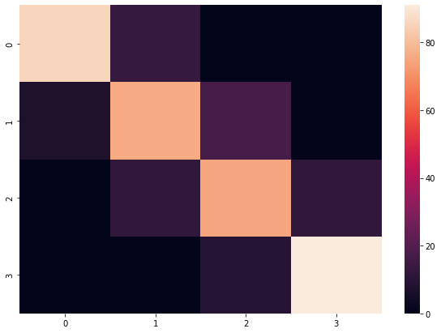
    


    

    


# Class 2


## Accuracy: 0.829
## Precision (weighted): 0.831
## Precision (macro): 0.832
## Precision (micro): 0.829
## Recall (weighted): 0.829
## Recall (macro): 0.829
## Recall (micro): 0.829
## F1 Score (weighted): 0.830
## F1 Score (macro): 0.830
## F1 Score (micro): 0.829
## Mean Squared Error: 0.171
## Mean Absolute Error: 0.171
## ROC AUC Score: 0.956


    Classification Report:
                   precision    recall  f1-score   support
    
               0       0.92      0.86      0.89        99
               1       0.75      0.78      0.76       100
               2       0.76      0.77      0.76        99
               3       0.89      0.91      0.90       100
    
        accuracy                           0.83       398
       macro avg       0.83      0.83      0.83       398
    weighted avg       0.83      0.83      0.83       398
    
    Confusion Matrix:
     [[85 14  0  0]
     [ 7 78 15  0]
     [ 0 12 76 11]
     [ 0  0  9 91]]


| Metric | 0 | 1 | 2 | 3 |
| ----------- | ----------- | ----------- | ----------- | ----------- |
| TPR | 0.859 | 0.780 | 0.768 | 0.910 | 
| FPR | 0.023 | 0.087 | 0.080 | 0.037 | 
| TNR | 0.977 | 0.913 | 0.920 | 0.963 | 
| FNR | 0.141 | 0.220 | 0.232 | 0.090 | 
| ERR | 0.053 | 0.121 | 0.118 | 0.050 | 
| ACC | 0.947 | 0.879 | 0.882 | 0.950 | 
| F1 | 0.890 | 0.765 | 0.764 | 0.901 | 
| AUC | 0.918 | 0.846 | 0.844 | 0.937 | 


    
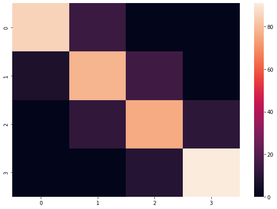
    


    
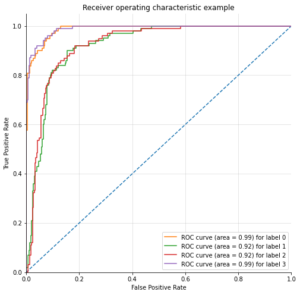
    


# Class 3


## Accuracy: 0.822
## Precision (weighted): 0.824
## Precision (macro): 0.824
## Precision (micro): 0.822
## Recall (weighted): 0.822
## Recall (macro): 0.822
## Recall (micro): 0.822
## F1 Score (weighted): 0.822
## F1 Score (macro): 0.822
## F1 Score (micro): 0.822
## Mean Squared Error: 0.178
## Mean Absolute Error: 0.178
## ROC AUC Score: 0.956


    Classification Report:
                   precision    recall  f1-score   support
    
               0       0.92      0.86      0.89        99
               1       0.74      0.77      0.75       100
               2       0.75      0.75      0.75        99
               3       0.88      0.91      0.90       100
    
        accuracy                           0.82       398
       macro avg       0.82      0.82      0.82       398
    weighted avg       0.82      0.82      0.82       398
    
    Confusion Matrix:
     [[85 14  0  0]
     [ 7 77 16  0]
     [ 0 13 74 12]
     [ 0  0  9 91]]


| Metric | 0 | 1 | 2 | 3 |
| ----------- | ----------- | ----------- | ----------- | ----------- |
| TPR | 0.859 | 0.770 | 0.747 | 0.910 | 
| FPR | 0.023 | 0.091 | 0.084 | 0.040 | 
| TNR | 0.977 | 0.909 | 0.916 | 0.960 | 
| FNR | 0.141 | 0.230 | 0.253 | 0.090 | 
| ERR | 0.053 | 0.126 | 0.126 | 0.053 | 
| ACC | 0.947 | 0.874 | 0.874 | 0.947 | 
| F1 | 0.890 | 0.755 | 0.747 | 0.897 | 
| AUC | 0.918 | 0.840 | 0.832 | 0.935 | 


    

    


    
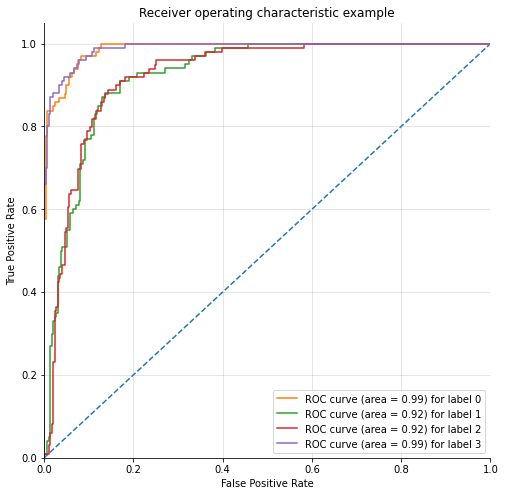
    


```python
for index,best_features in enumerate(best_features_per_class_encoded):
    X_selected = X[best_features]
    X_tr, X_te, y_tr, y_te = train_test_split(X_selected, data_sets[index]['price_range'], test_size=0.2, random_state=0, stratify=data_sets[index]['price_range'])
    model = GaussianNB()
    model.fit(X_tr, y_tr)
    y_pred = model.predict(X_te)
    printmd(f"## Data Set {index}")
    print(classification_report(y_te, y_pred))    
```


## Data Set 0


                  precision    recall  f1-score   support
    
             0.0       0.98      0.97      0.97       299
             1.0       0.90      0.95      0.93        99
    
        accuracy                           0.96       398
       macro avg       0.94      0.96      0.95       398
    weighted avg       0.96      0.96      0.96       398
    


## Data Set 1


                  precision    recall  f1-score   support
    
             0.0       0.79      0.99      0.88       299
             1.0       0.88      0.22      0.35        99
    
        accuracy                           0.80       398
       macro avg       0.84      0.61      0.62       398
    weighted avg       0.82      0.80      0.75       398
    


## Data Set 2


                  precision    recall  f1-score   support
    
             0.0       0.78      0.98      0.87       299
             1.0       0.75      0.18      0.29        99
    
        accuracy                           0.78       398
       macro avg       0.77      0.58      0.58       398
    weighted avg       0.78      0.78      0.73       398
    


## Data Set 3


                  precision    recall  f1-score   support
    
             0.0       0.98      0.96      0.97       298
             1.0       0.90      0.94      0.92       100
    
        accuracy                           0.96       398
       macro avg       0.94      0.95      0.94       398
    weighted avg       0.96      0.96      0.96       398
    


```python
# from sklearn.inspection import permutation_importance
# imps = permutation_importance(model, X_test, y_test)
# print(imps.importances_mean)
# gnb_feature = pd.Series(imps.importances_mean, index=features.columns)
# highest_importance = gnb_feature.nlargest(10)
# gnb_feature.nlargest(10).plot(kind='barh')
# plt.show()
# print(highest_importance)
```
